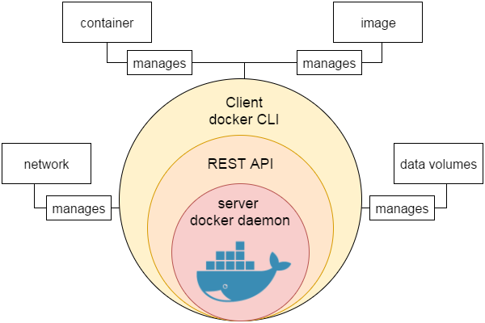
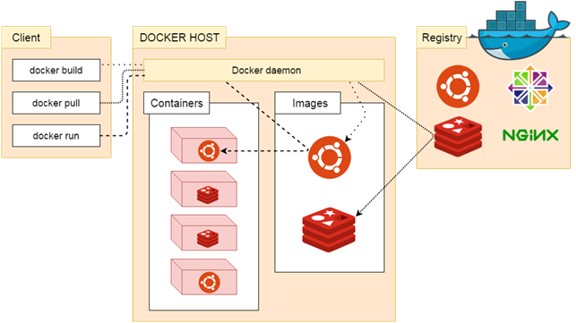
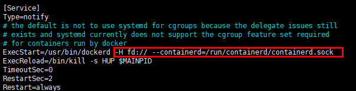
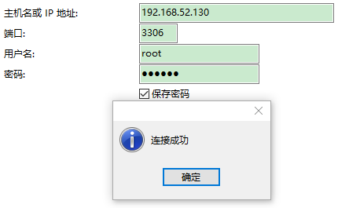
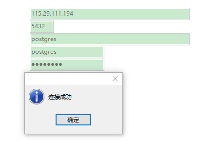
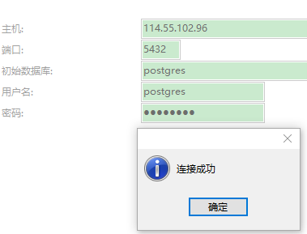

# Docker

## Docker 简介

>Docker 是一个开源的应用容器引擎，基于 Go 语言 并遵从 Apache2.0 协议开源。
>
>Docker 可以让开发者打包他们的应用以及依赖包到一个轻量级、可移植的容器中，然后发布到任何流行的 Linux 机器上，也可以实现虚拟化。
>
>容器是完全使用沙箱机制，相互之间不会有任何接口 (类似 iPhone 的 app)，更重要的是容器性能开销极低。

### Docker 的应用场景

- Web 应用的自动化打包和发布
- 自动化测试和持续集成、发布
- 在服务型环境中部署和调整数据库或其他的后台应用
- 从头编译或者扩展现有的 OpenShift 或 Cloud Foundry 平台来搭建自己的 PaaS (Platform-as-a-Service) 环境

### Docker 的优点

- 简化程序：Docker 让开发者可以打包他们的应用以及依赖包到一个可移植的容器中，然后发布到任何流行的 Linux 机器上，便可以实现虚拟化。Docker改变了虚拟化的方式，使开发者可以直接将自己的成果放入Docker中进行管理。方便快捷已经是 Docker的最大优势，过去需要用数天乃至数周的 任务，在Docker容器的处理下，只需要数秒就能完成。
- 避免选择恐惧症：如果有选择恐惧症，还是资深患者。Docker 帮你打包你的纠结！比如 Docker 镜像；Docker 镜像中包含了运行环境和配置，所以 Docker 可以简化部署多种应用实例工作。比如 Web 应用、后台应用、数据库应用、大数据应用比如 Hadoop 集群、消息队列等等都可以打包成一个镜像部署。
- 节省开支：一方面，云计算时代到来，使开发者不必为了追求效果而配置高额的硬件，Docker 改变了高性能必然高价格的思维定势。Docker 与云的结合，让云空间得到更充分的利用。不仅解决了硬件管理的问题，也改变了虚拟化的方式。

### Docker 引擎

Docker 引擎是一个包含以下主要组件的客户端服务器应用程序。

- 一种服务器，它是一种称为守护进程并且长时间运行的程序。
- REST API用于指定程序可以用来与守护进程通信的接口，并指示它做什么。
- 一个有命令行界面 (CLI) 工具的客户端。

Docker 引擎组件的流程如下图所示：



------


## Docker  功能特点

### 轻松快捷的配置

这是Docker的一个主要功能，可帮助开发者轻松快速地配置系统。可以在更少的时间和精力的情况下部署代码。 由于Docker可以在各种各样的环境中使用，基础架构不再要求与应用程序的环境相关联。

### 提高工作效率

通过放宽技术配置和应用的快速部署。 毫无疑问，它节约了时间提高了生产率。 Docker不仅有助于在孤立环境中执行应用程序，而且还减少了资源。

### 应用隔离

Docker提供用于在隔离环境中运行应用程序的容器。 每个容器独立于另一个容器，并允许执行任何类型的应用程序。

### 云调度

它是Docker容器的集群和调度工具。 Swarm使用Docker API作为其前端，这有助于开发者使用各种工具来控制它。 它还可以将Docker主机集群控制为一个虚拟主机。 这是一个用于启用可插拔后端的自组织引擎组。

### 路由网

它将可用节点上已发布端口的传入请求路由到活动容器。 即使节点上没有任务正在运行，此功能也可以实现连接。

### 服务

服务是允许指定集群内的容器状态的任务列表。 每个任务表示一个应该运行的容器的一个实例，并且Swarm在节点之间调度它们。

### 安全管理

它允许将保密数据保存到云群 (swarm) 中，然后选择给予服务访问某些保密数据。它包括一些重要的命令给引擎，如保密数据检查，保密数据创建等。

------


## Docker 系统架构

> Docker 使用客户端-服务器 (C/S) 架构模式，使用远程 API 来管理和创建 Docker 容器。
>
> Docker 容器通过 Docker 镜像来创建。
>
> 容器与镜像的关系类似于面向对象编程中的对象与类。

**类比:**

| Docker | 面向对象 |
| :----- | :------- |
| 容器   | 对象     |
| 镜像   | 类       |

**架构图:**

**说明:**

| 标题            | 说明                                                         |
| :-------------- | :----------------------------------------------------------- |
| 镜像(Images)    | Docker 镜像是用于创建 Docker 容器的模板。                    |
| 容器(Container) | 容器是独立运行的一个或一组应用。                             |
| 客户端(Client)  | Docker 客户端通过命令行或者其他工具使用 [Docker API](https://docs.docker.com/reference/api/docker_remote_api)  与 Docker 的守护进程通信。 |
| 主机(Host)      | 一个物理或者虚拟的机器用于执行 Docker 守护进程和容器。       |
| 仓库(Registry)  | Docker 仓库用来保存镜像，可以理解为代码控制中的代码仓库。[Docker Hub](https://hub.docker.com) 提供了庞大的镜像集合供使用。 |
| Docker Machine  | Docker Machine是一个简化Docker安装的命令行工具，通过一个简单的命令行即可在相应的平台上安装Docker，比如VirtualBox、 Digital Ocean、Microsoft Azure。 |

------


## Docker 安装

> 可以在任何操作系统上安装 Docker，无论是 Mac，Windows，Linux 还是任何云服务器。Docker 引擎在 Linux 发行版上运行。 

### 前提条件

Docker 需要两个重要的安装要求：

- 它仅适用于 64 位 Linux 安装
- 它需要 Linux 内核版本 3.10 或更高版本。

要查看当前的内核版本，请打开终端并键入`uname -r`命令以查看内核版本：

```
GG42@ubuntu:/home/ubuntu# uname -r
4.15.0-91-generic
```

查看操作系统是32位还是64位：

```
GG42@ubuntu:/home/ubuntu# uname --m
x86_64
```

### 使用脚本安装 Docker

使用在线安装脚本

```
curl -sSL https://get.daocloud.io/docker | sh
```

执行后会自动下载并安装 Docker 及依赖包

```
GG42@Ubuntu:~$ curl -sSL https://get.daocloud.io/docker | sh
# Executing docker install script, commit: 49ee7c1
+ sudo -E sh -c apt-get update -qq >/dev/null
+ sudo -E sh -c apt-get install -y -qq apt-transport-https ca-certificates curl software-properties-common >/dev/null
+ sudo -E sh -c curl -fsSL "https://download.docker.com/linux/ubuntu/gpg" | apt-key add -qq - >/dev/null
+ sudo -E sh -c echo "deb [arch=amd64] https://download.docker.com/linux/ubuntu xenial edge" > /etc/apt/sources.list.d/docker.list
+ [ ubuntu = debian ]
+ sudo -E sh -c apt-get update -qq >/dev/null
+ sudo -E sh -c apt-get install -y -qq --no-install-recommends docker-ce >/dev/null
+ sudo -E sh -c docker version
Client:
 Version:      17.10.0-ce
 API version:  1.33
 Go version:   go1.8.3
 Git commit:   f4ffd25
 Built:        Tue Oct 17 19:04:16 2017
 OS/Arch:      linux/amd64

Server:
 Version:      17.10.0-ce
 API version:  1.33 (minimum version 1.12)
 Go version:   go1.8.3
 Git commit:   f4ffd25
 Built:        Tue Oct 17 19:02:56 2017
 OS/Arch:      linux/amd64
 Experimental: false
If you would like to use Docker as a non-root user, you should now consider
adding your user to the "docker" group with something like:

  sudo usermod -aG docker GG42

Remember that you will have to log out and back in for this to take effect!

WARNING: Adding a user to the "docker" group will grant the ability to run
         containers which can be used to obtain root privileges on the
         docker host.
         Refer to https://docs.docker.com/engine/security/security/#docker-daemon-attack-surface
         for more information.
```

完成后有个提示

```
If you would like to use Docker as a non-root user, you should now consider
adding your user to the "docker" group with something like:

  sudo usermod -aG docker GG42

Remember that you will have to log out and back in for this to take effect!
```

当要以非 root 用户可以直接运行 docker 时，需要执行 `sudo usermod -aG docker 某个用户` 命令，然后重新登陆，否则会有如下报错

```
GG42@Ubuntu:~$ docker run hello-world
docker: Got permission denied while trying to connect to the Docker daemon socket at unix:///var/run/docker.sock: Post http://%2Fvar%2Frun%2Fdocker.sock/v1.33/containers/create: dial unix /var/run/docker.sock: connect: permission denied.
See 'docker run --help'.
```

### 启动 Docker 后台服务

```
service docker start
```

### 查看 Docker 当前版本

```
GG42@Ubuntu:~$ docker version
Client:
 Version:      17.10.0-ce
 API version:  1.33
 Go version:   go1.8.3
 Git commit:   f4ffd25
 Built:        Tue Oct 17 19:04:16 2017
 OS/Arch:      linux/amd64

Server:
 Version:      17.10.0-ce
 API version:  1.33 (minimum version 1.12)
 Go version:   go1.8.3
 Git commit:   f4ffd25
 Built:        Tue Oct 17 19:02:56 2017
 OS/Arch:      linux/amd64
 Experimental: false
```

### 配置加速器

由于网络原因，在 pull Image 的时候，从 `Docker Hub` 上下载会很慢... 所以，国内的 Docker 爱好者们就添加了一些国内的镜像 (mirror),方便大家使用。

#### 方案一

修改配置文件

```
nano /lib/systemd/system/docker.service
```

添加 `--registry-mirror=https://jxus37ac.mirror.aliyuncs.com` 到 ExecStart：



修改为:


#### 方案二

在`/etc/docker/`下创建`daemon.json`文件(如果没有):

```json
{
  "registry-mirrors": ["https://icn9xgv4.mirror.aliyuncs.com","http://hub-mirror.c.163.com","https://registry.docker-cn.com"]
}
```

**方案一,二最后更新配置,并重启服务**:

保存配置：`systemctl daemon-reload`

重启服务：`service docker restart`

#### Docker 国内镜像

[阿里云的加速器](https://help.aliyun.com/document_detail/60750.html)

网易加速器：`http://hub-mirror.c.163.com`

官方中国加速器：`https://registry.docker-cn.com`

ustc 的镜像：`https://docker.mirrors.ustc.edu.cn`

[daocloud](https://www.daocloud.io/mirror#accelerator-doc)（注册后使用）

```shell
http://hub-mirror.c.163.com
https://registry.docker-cn.com
https://docker.mirrors.ustc.edu.cn
https://icn9xgv4.mirror.aliyuncs.com
```


### docker search 或 docker pull 出现 response timeout 错误

如果配置了docker镜像源,则更改 Linux 网络配置:

查看服务器NDS网络配置

```shell
cd /etc/netplan/

ll
*.yaml

vi *.yaml
```

将里面的内容注释,并改为:

```shell
nameserver 8.8.8.8
nameserver 8.8.8.4
```

重启网络配置

```shell
systemctl restart network
# 新版 ubuntu
netplan apply
```

------


## 卸载旧版本Docker

```shell
apt-get autoremove docker docker-ce docker-engine  docker.io  containerd runc
apt-get remove docker docker-engine docker.io containerd runc
apt-get autoclean
```


## Docker 基本使用

### Docker 应用程序

> Docker 允许在容器内运行应用程序，使用 docker run 命令来在容器内运行一个应用程序。

输出 Hello Docker:

```shell
GG42@Ubuntu:~$ docker run ubuntu:15.10 /bin/echo "Hello Docker"
Hello Docker
```

参数解释：

- docker：Docker 的二进制执行文件
- run：与前面的 docker 组合来运行一个容器
- ubuntu:15.10：指定要运行的镜像，Docker首先从本地主机上查找镜像是否存在，如果不存在，Docker 就会从镜像仓库 Docker Hub 下载公共镜像
- /bin/echo "Hello Docker"：在启动的容器里执行的命令

以上命令完整的意思可以解释为：Docker 以 ubuntu15.10 镜像创建一个新容器，然后在容器里执行 bin/echo "Hello Docker"，然后输出结果。


### 运行交互式的容器

通过 docker 的两个参数 `-i` `-t`，让 docker 运行的容器实现"对话"的能力

```
GG42@Ubuntu:~$ docker run -it ubuntu:15.10 /bin/bash
root@76ab065de67b:/#
```

参数解释：

- `-t`：在新容器内指定一个伪终端或终端
- `-i`：允许对容器内的标准输入进行交互
- `ubuntu:` ubuntu 镜像
- `:15.10:`ubuntu 版本号.
- `/bin/bash`：放在镜像名后的是命令，这里希望有个交互式 Shell，因此用的是 /bin/bash。

此时已进入一个 ubuntu15.10 系统的容器

尝试在容器中运行命令 cat /proc/version 和 ls 分别查看当前系统的版本信息和当前目录下的文件列表

```
root@76ab065de67b:/# cat /proc/version
Linux version 4.4.0-21-generic (buildd@lgw01-21) (gcc version 5.3.1 20160413 (Ubuntu 5.3.1-14ubuntu2) ) #37-Ubuntu SMP Mon Apr 18 18:33:37 UTC 2016
root@76ab065de67b:/# ls
bin  boot  dev  etc  home  lib  lib64  media  mnt  opt  proc  root  run  sbin  srv  sys  tmp  usr  var
```

退出容器：

- 运行 `exit`
- 使用 `CTRL + D`


### 以后台的方式运行容器

使用以下命令创建一个以进程方式运行的容器

```
root@ubuntu:~# docker run -d ubuntu:15.10 /bin/sh -c "while true; do echo hello docker; sleep 1; done"
2ab101b86f8c95daf431cfa8ac84a21adf8dc13c1a8127aa43f421942ff7a219
```

通过 docker 参数 `-d `，让 docker 以进程方式运行的容器

在输出中，没有看到"hello docker"，而是一串长字符

```
2ab101b86f8c95daf431cfa8ac84a21adf8dc13c1a8127aa43f421942ff7a219
```

这个长字符串叫做容器ID，对每个容器来说都是唯一的，可以通过容器ID来查看对应的容器发生了什么。

首先，需要确认容器有在运行，可以通过 `docker ps` 来查看

```
root@UbuntuBase:~$ docker ps
root@ubuntu:~# docker ps
CONTAINER ID        IMAGE               COMMAND                  CREATED              STATUS              PORTS               NAMES
2ab101b86f8c        ubuntu:15.10        "/bin/sh -c 'while t…"   About a minute ago   Up About a minute                       tender_shannon
```

CONTAINER ID：容器ID

NAMES：自动分配的容器名称

在容器内使用 `docker logs` 或 `docker -f logs `命令，查看容器内的标准输出

```
root@ubuntu:~# docker logs -f 2ab101b86f8c
hello docker
hello docker
hello docker
hello docker
hello docker
hello docker
hello docker
hello docker
hello docker
hello docker
hello docker
hello docker
hello docker
hello docker
```

#### 与正在运行的容器交互

- **dokcer attach**

  ```shell
  docker attach 2ab101b86f8c
  ```

  **注意:**如果从这个容器退出，会导致容器的停止

- **docker exec**:

  ```shell
  docker exec -it <container> /bin/bash
  ```

  **注意:**如果从这个容器退出，不会导致容器的停止,更多的参数说明使用`docker exec --help`

例如:

```shell
root@ubuntu:~# docker exec -it 2ab101b86f8c /bin/bash
root@2ab101b86f8c:/# ll
total 72
drwxr-xr-x   1 root root 4096 Mar 23 13:48 ./
drwxr-xr-x   1 root root 4096 Mar 23 13:48 ../
-rwxr-xr-x   1 root root    0 Mar 23 13:48 .dockerenv*
drwxr-xr-x   2 root root 4096 Jul  6  2016 bin/
drwxr-xr-x   2 root root 4096 Oct 19  2015 boot/
drwxr-xr-x   5 root root  340 Mar 23 13:48 dev/
drwxr-xr-x   1 root root 4096 Mar 23 13:48 etc/
```


### 停止容器

命令:`docker stop <container>` 

```shell
root@ubuntu:~# docker stop 2ab101b86f8
2ab101b86f8

root@ubuntu:~# docker ps -a
CONTAINER ID        IMAGE               COMMAND             CREATED             STATUS              PORTS               NAMES
```

------


## Docker 容器管理

### Docker 客户端

docker客户端非常简单，可以直接输入`docker`命令来查看到Docker客户端的所有命令选项。

```shell
root@ubuntu:~# docker

Usage:	docker [OPTIONS] COMMAND

A self-sufficient runtime for containers

Options:
      --config string      Location of client config files (default "/root/.docker")
  -c, --context string     Name of the context to use to connect to the daemon (overrides DOCKER_HOST env
                           var and default context set with "docker context use")
  -D, --debug              Enable debug mode
  -H, --host list          Daemon socket(s) to connect to
  -l, --log-level string   Set the logging level ("debug"|"info"|"warn"|"error"|"fatal") (default "info")
      --tls                Use TLS; implied by --tlsverify
      --tlscacert string   Trust certs signed only by this CA (default "/root/.docker/ca.pem")
      --tlscert string     Path to TLS certificate file (default "/root/.docker/cert.pem")
      --tlskey string      Path to TLS key file (default "/root/.docker/key.pem")
      --tlsverify          Use TLS and verify the remote
  -v, --version            Print version information and quit

Management Commands:
  builder     Manage builds
  config      Manage Docker configs
  container   Manage containers
  context     Manage contexts
  engine      Manage the docker engine
  image       Manage images
  network     Manage networks
  node        Manage Swarm nodes
  plugin      Manage plugins
  secret      Manage Docker secrets
  service     Manage services
  stack       Manage Docker stacks
  swarm       Manage Swarm
  system      Manage Docker
  trust       Manage trust on Docker images
  volume      Manage volumes

Commands:
  attach      Attach local standard input, output, and error streams to a running container
  build       Build an image from a Dockerfile
  commit      Create a new image from a container's changes
  cp          Copy files/folders between a container and the local filesystem
  create      Create a new container
  diff        Inspect changes to files or directories on a container's filesystem
  events      Get real time events from the server
  exec        Run a command in a running container
  export      Export a container's filesystem as a tar archive
  history     Show the history of an image
  images      List images
  import      Import the contents from a tarball to create a filesystem image
  info        Display system-wide information
  inspect     Return low-level information on Docker objects
  kill        Kill one or more running containers
  load        Load an image from a tar archive or STDIN
  login       Log in to a Docker registry
  logout      Log out from a Docker registry
  logs        Fetch the logs of a container
  pause       Pause all processes within one or more containers
  port        List port mappings or a specific mapping for the container
  ps          List containers
  pull        Pull an image or a repository from a registry
  push        Push an image or a repository to a registry
  rename      Rename a container
  restart     Restart one or more containers
  rm          Remove one or more containers
  rmi         Remove one or more images
  run         Run a command in a new container
  save        Save one or more images to a tar archive (streamed to STDOUT by default)
  search      Search the Docker Hub for images
  start       Start one or more stopped containers
  stats       Display a live stream of container(s) resource usage statistics
  stop        Stop one or more running containers
  tag         Create a tag TARGET_IMAGE that refers to SOURCE_IMAGE
  top         Display the running processes of a container
  unpause     Unpause all processes within one or more containers
  update      Update configuration of one or more containers
  version     Show the Docker version information
  wait        Block until one or more containers stop, then print their exit codes

```

可以通过命令`docker command --help`更深入的了解指定的Docker命令使用方法。

例如要查看`docker stats`指令的具体使用方法：

``` shell
root@UbuntuBase:~$ docker stats --help

Usage:    docker stats [OPTIONS] [CONTAINER...]

Display a live stream of container(s) resource usage statistics

Options:
  -a, --all             Show all containers (default shows just running)
      --format string   Pretty-print images using a Go template
      --help            Print usage
      --no-stream       Disable streaming stats and only pull the first result
      --no-trunc        Do not truncate output
```

### 运行 WEB 容器

使用docker构建一个web应用程序,将在docker容器中运行一个Python Flask应用来运行一个web应用。

```shell
root@ubuntu:~# docker run -d -P training/webapp python app.py
41fb6df8992ed8391045cbdc2b5d6b7deb7c45ca0d31f1afe62d4e13b094cc2e
```

参数说明：

- `-d`：让容器在后台运行
- `-P`：将容器内部使用的网络端口映射到使用的主机上
- `-p`:   绑定指定端口

```shell
docker run -d -p 3000:5000 training/webapp python app.py
26d4cf1edcdb7a25bc2d7bb54c01927c97934e25805dcd434a394064947cb2f1
```

**注意**:将宿主机的5000端口与容器中的5000端口进行映射.

### 查看 WEB 容器

使用 `docker ps` 来查看正在运行的容器

```shell
root@ubuntu:~# docker ps
CONTAINER ID        IMAGE               COMMAND             CREATED             STATUS              PORTS                    NAMES
628546ff23bd        training/webapp     "python app.py"     42 seconds ago      Up 41 seconds       0.0.0.0:3000->5000/tcp   vigorous_curran
```

这里多了端口信息:

```
PORTS
0.0.0.0:3000->5000/tcp
```

Docker 开放了 `3000` 端口（默认 Python Flask 端口）映射到主机端口 `32771` 上。

这时可以通过浏览器访问WEB应用


### 查看 WEB 应用日志

`docker logs <container>` 可以查看容器内部的标准输出：

```shell
root@ubuntu:~# docker logs -f vigorous_curran 
 * Running on http://0.0.0.0:5000/ (Press CTRL+C to quit)
192.168.52.1 - - [24/Mar/2020 14:18:42] "GET / HTTP/1.1" 200 -
192.168.52.1 - - [24/Mar/2020 14:18:43] "GET /favicon.ico HTTP/1.1" 404 -
```

参数说明：

- `-f`：让 dokcer logs 像使用 tail -f 一样来输出容器内部的标准输出

应用程序使用的是 5000 端口并且能够查看到应用程序的访问日志。

### 查看 WEB 应用容器的进程

使用 `docker top <container>` 来查看容器内部运行的进程:

```shell
root@ubuntu:~# docker top vigorous_curran 
UID                 PID                 PPID                C                   STIME               TTY                 TIME                CMD
root                3777                3745                0                   14:18               ?                   00:00:00            python app.py

```


### 检查 WEB 应用程序

使用 `docker inspect` 来查看Docker的底层信息。它会返回一个 JSON 文件记录着 Docker 容器的配置和状态信息：

```shell
root@ubuntu:~# docker inspect vigorous_curran 
[
    {
        "Id": "628546ff23bd660867c9d1753b90685bec3109a1bdbfbbf8c19d7397235d05c4",
        "Created": "2020-03-24T14:18:31.147728231Z",
        "Path": "python",
        "Args": [
            "app.py"
        ],
        "State": {
            "Status": "running",
            "Running": true,
            "Paused": false,
            "Restarting": false,
            "OOMKilled": false,
            "Dead": false,
            "Pid": 3777,
            "ExitCode": 0,
            "Error": "",
            "StartedAt": "2020-03-24T14:18:32.07062617Z",
            "FinishedAt": "0001-01-01T00:00:00Z"
        },
        "Image": "sha256:6fae60ef344644649a39240b94d73b8ba9c67f898ede85cf8e947a887b3e6557",
        "ResolvConfPath": "/var/lib/docker/containers/628546ff23bd660867c9d1753b90685bec3109a1bdbfbbf8c19d7397235d05c4/resolv.conf",
        "HostnamePath": "/var/lib/docker/containers/628546ff23bd660867c9d1753b90685bec3109a1bdbfbbf8c19d7397235d05c4/hostname",
        "HostsPath": "/var/lib/docker/containers/628546ff23bd660867c9d1753b90685bec3109a1bdbfbbf8c19d7397235d05c4/hosts",
        "LogPath": "/var/lib/docker/containers/628546ff23bd660867c9d1753b90685bec3109a1bdbfbbf8c19d7397235d05c4/628546ff23bd660867c9d1753b90685bec3109a1bdbfbbf8c19d7397235d05c4-json.log",
        "Name": "/vigorous_curran",
        "RestartCount": 0,
        "Driver": "overlay2",
        "Platform": "linux",
        "MountLabel": "",
        "ProcessLabel": "",
        "AppArmorProfile": "docker-default",
        "ExecIDs": null,
        "HostConfig": {
            "Binds": null,
            "ContainerIDFile": "",
            "LogConfig": {
                "Type": "json-file",
                "Config": {}
            },
            "NetworkMode": "default",
            "PortBindings": {
                "5000/tcp": [
                    {
                        "HostIp": "",
                        "HostPort": "3000"
                    }
                ]
            },
            "RestartPolicy": {
                "Name": "no",
                "MaximumRetryCount": 0
            },
            "AutoRemove": false,
            "VolumeDriver": "",
            "VolumesFrom": null,
            "CapAdd": null,
            "CapDrop": null,
            "Capabilities": null,
            "Dns": [],
            "DnsOptions": [],
            "DnsSearch": [],
            "ExtraHosts": null,
            "GroupAdd": null,
            "IpcMode": "private",
            "Cgroup": "",
            "Links": null,
            "OomScoreAdj": 0,
            "PidMode": "",
            "Privileged": false,
            "PublishAllPorts": false,
            "ReadonlyRootfs": false,
            "SecurityOpt": null,
            "UTSMode": "",
            "UsernsMode": "",
            "ShmSize": 67108864,
            "Runtime": "runc",
            "ConsoleSize": [
                0,
                0
            ],
            "Isolation": "",
            "CpuShares": 0,
            "Memory": 0,
            "NanoCpus": 0,
            "CgroupParent": "",
            "BlkioWeight": 0,
            "BlkioWeightDevice": [],
            "BlkioDeviceReadBps": null,
            "BlkioDeviceWriteBps": null,
            "BlkioDeviceReadIOps": null,
            "BlkioDeviceWriteIOps": null,
            "CpuPeriod": 0,
            "CpuQuota": 0,
            "CpuRealtimePeriod": 0,
            "CpuRealtimeRuntime": 0,
            "CpusetCpus": "",
            "CpusetMems": "",
            "Devices": [],
            "DeviceCgroupRules": null,
            "DeviceRequests": null,
            "KernelMemory": 0,
            "KernelMemoryTCP": 0,
            "MemoryReservation": 0,
            "MemorySwap": 0,
            "MemorySwappiness": null,
            "OomKillDisable": false,
            "PidsLimit": null,
            "Ulimits": null,
            "CpuCount": 0,
            "CpuPercent": 0,
            "IOMaximumIOps": 0,
            "IOMaximumBandwidth": 0,
            "MaskedPaths": [
                "/proc/asound",
                "/proc/acpi",
                "/proc/kcore",
                "/proc/keys",
                "/proc/latency_stats",
                "/proc/timer_list",
                "/proc/timer_stats",
                "/proc/sched_debug",
                "/proc/scsi",
                "/sys/firmware"
            ],
            "ReadonlyPaths": [
                "/proc/bus",
                "/proc/fs",
                "/proc/irq",
                "/proc/sys",
                "/proc/sysrq-trigger"
            ]
        },
        "GraphDriver": {
            "Data": {
                "LowerDir": "/var/lib/docker/overlay2/5c49d38485ec183a83f2460e7305f9f4733d3d81662290f3a6b9edc588baa263-init/diff:/var/lib/docker/overlay2/07985c1f99e72a68bcff5bf8e8c19a3a6955931e3012671472cc8674cedaff58/diff:/var/lib/docker/overlay2/f96f9d4652810fc7c45d6223814c2ef88079328e41574ba91c6f70ddb3476230/diff:/var/lib/docker/overlay2/b546fe44d7fbefb8ab177b37c86fd66ea5a7adcf98877d271cecda5888a60b20/diff:/var/lib/docker/overlay2/63e97139498840ac9f97ef783c7897fcf897d7198f64a5b11affacbc3f49841b/diff:/var/lib/docker/overlay2/6c36ced57d4d77f619e18d6aa3cb4838f827f3c5422c16322675ef6b9cafc807/diff:/var/lib/docker/overlay2/6b4f3ec23381191729f37947b656201b937aeb3eea4809b956d2e6791f819c3d/diff:/var/lib/docker/overlay2/793430711c24d301da3ed6cb1079784c1e7b2b2003877d26d939bf258892b6c2/diff:/var/lib/docker/overlay2/64b0315635440d239e0cc9e1e06c646b8716121dc591fe776c6954c1a3eee67c/diff:/var/lib/docker/overlay2/89f8f0d396a255345a40784dd49176a1c218ab0075ccdb999a180a3a4042be82/diff:/var/lib/docker/overlay2/9d9da79fa448fef849f52fdccce65337fbe6aca83253917233703158a4c458e0/diff:/var/lib/docker/overlay2/b015f51c8c85747a054fe832ca8b1008894792c563ecf889c62c9c1fdba78d66/diff:/var/lib/docker/overlay2/f7216a32f66b1d55e0bb62bdf79bfa72265bf236ea3f19633a33397613d09721/diff:/var/lib/docker/overlay2/6507a08dbe58aea3a9119014ca87b13ed1366ffe8160ba86d843bfa13d622f06/diff",
                "MergedDir": "/var/lib/docker/overlay2/5c49d38485ec183a83f2460e7305f9f4733d3d81662290f3a6b9edc588baa263/merged",
                "UpperDir": "/var/lib/docker/overlay2/5c49d38485ec183a83f2460e7305f9f4733d3d81662290f3a6b9edc588baa263/diff",
                "WorkDir": "/var/lib/docker/overlay2/5c49d38485ec183a83f2460e7305f9f4733d3d81662290f3a6b9edc588baa263/work"
            },
            "Name": "overlay2"
        },
        "Mounts": [],
        "Config": {
            "Hostname": "628546ff23bd",
            "Domainname": "",
            "User": "",
            "AttachStdin": false,
            "AttachStdout": false,
            "AttachStderr": false,
            "ExposedPorts": {
                "5000/tcp": {}
            },
            "Tty": false,
            "OpenStdin": false,
            "StdinOnce": false,
            "Env": [
                "PATH=/usr/local/sbin:/usr/local/bin:/usr/sbin:/usr/bin:/sbin:/bin"
            ],
            "Cmd": [
                "python",
                "app.py"
            ],
            "Image": "training/webapp",
            "Volumes": null,
            "WorkingDir": "/opt/webapp",
            "Entrypoint": null,
            "OnBuild": null,
            "Labels": {}
        },
        "NetworkSettings": {
            "Bridge": "",
            "SandboxID": "7e6f72193012698b9a224701cf4630910cd5077679ca8d87df024a23a8fa388b",
            "HairpinMode": false,
            "LinkLocalIPv6Address": "",
            "LinkLocalIPv6PrefixLen": 0,
            "Ports": {
                "5000/tcp": [
                    {
                        "HostIp": "0.0.0.0",
                        "HostPort": "3000"
                    }
                ]
            },
            "SandboxKey": "/var/run/docker/netns/7e6f72193012",
            "SecondaryIPAddresses": null,
            "SecondaryIPv6Addresses": null,
            "EndpointID": "4db3cae4cb035ab9ba49475d3107d60fb78b26559c6caec2949e3e8ace2f6691",
            "Gateway": "172.17.0.1",
            "GlobalIPv6Address": "",
            "GlobalIPv6PrefixLen": 0,
            "IPAddress": "172.17.0.2",
            "IPPrefixLen": 16,
            "IPv6Gateway": "",
            "MacAddress": "02:42:ac:11:00:02",
            "Networks": {
                "bridge": {
                    "IPAMConfig": null,
                    "Links": null,
                    "Aliases": null,
                    "NetworkID": "9832d7824b75753cab36e85ab70f9ea2bb8f31fde62a8d19e523c31070c8d5f7",
                    "EndpointID": "4db3cae4cb035ab9ba49475d3107d60fb78b26559c6caec2949e3e8ace2f6691",
                    "Gateway": "172.17.0.1",
                    "IPAddress": "172.17.0.2",
                    "IPPrefixLen": 16,
                    "IPv6Gateway": "",
                    "GlobalIPv6Address": "",
                    "GlobalIPv6PrefixLen": 0,
                    "MacAddress": "02:42:ac:11:00:02",
                    "DriverOpts": null
                }
            }
        }
    }
]
```


### 重启 WEB 应用容器

#### 停止WEB应用容器

```shell
docker stop  <container>
```

#### 已经停止的容器，使用命令 `docker start` 来启动

```shell
docker start <container>
```

#### 重启WEB应用容器

```shell
docker restart <container>
```

#### 查询全部容器

```shell
docker ps -a
```

#### 查询最后一次创建的容器

```shell
docker ps -l
```


### 移除 WEB 应用容器

使用 `docker rm <container 1> <container 2> ... <container N>` 命令来删除不需要的容器：

```
root@ubuntu:~# docker rm 628546ff23bd vigorous_curran 
628546ff23bd
vigorous_curran 
```

**注意：**删除容器时，容器必须是停止状态，否则会报错

------


## Docker 镜像管理

> 当运行容器时，使用的镜像如果在本地中不存在，docker 就会自动从 docker 镜像仓库中下载，默认是从 [Docker Hub](https://hub.docker.com/) 公共镜像源下载。

### 镜像列表

可以使用 `docker images` 来列出本地主机上的镜像：

```
root@ubuntu:~# docker images
REPOSITORY          TAG                 IMAGE ID            CREATED             SIZE
ubuntu              15.10               9b9cb95443b5        3 years ago         137MB
training/webapp     latest              6fae60ef3446        4 years ago         349MB
```

选项说明：

- **REPOSITORY**：表示镜像的仓库源
- **TAG**：镜像的标签
- **IMAGE ID**：镜像ID
- **CREATED**：镜像创建时间
- **SIZE**：镜像大小

同一仓库源可以有多个 TAG，代表这个仓库源的不同个版本，如 ubuntu 仓库源里，有15.10、14.04等多个不同的版本，使用 `REPOSITORY:TAG` 来定义不同的镜像。

所以，如果要使用版本为15.10的ubuntu系统镜像来运行容器时，命令如下：

```shell
docker run -it ubuntu:15.10 /bin/bash
```

如果要使用版本为14.04的ubuntu系统镜像来运行容器时，命令如下：

```shell
docker run -it ubuntu:14.04 /bin/bash
```

如果不指定一个镜像的版本标签，例如只使用 `ubuntu`，docker 将默认使用 `ubuntu:latest `镜像。


### 获取镜像

在本地主机上使用一个不存在的镜像时 Docker 就会自动下载这个镜像。如果想预先下载这个镜像，可以使用 `docker pull` 命令来下载它。

```shell
root@ubuntu:~# docker pull tomcat
Using default tag: latest
latest: Pulling from library/tomcat
50e431f79093: Pull complete 
dd8c6d374ea5: Pull complete 
c85513200d84: Pull complete 
55769680e827: Pull complete 
e27ce2095ec2: Pull complete 
5943eea6cb7c: Pull complete 
3ed8ceae72a6: Pull complete 
91d1e510d72b: Pull complete 
415cc4506e71: Pull complete 
a79d88064227: Pull complete 
Digest: sha256:b707d3b8b4f40951ca2f387c24ab9f78800c69c90740f0cca937a1b95204b3a4
Status: Downloaded newer image for tomcat:latest
docker.io/library/tomcat:latest
```

下载完成后，可以直接使用这个镜像来运行容器。


### 查找镜像

> 可以从 Docker Hub 网站来搜索镜像，Docker Hub 网址为： https://hub.docker.com/

也可以使用 `docker search` 命令来搜索镜像。比如需要一个 `ubuntu`的镜像。可以通过 `docker search` 命令搜索 `mysql` 来寻找适合的镜像。

```
root@UbuntuBase:~$ docker search ubuntu
NAME                                                   DESCRIPTION                                     STARS               OFFICIAL            AUTOMATED
ubuntu                                                 Ubuntu is a Debian-based Linux operating s...   6759                [OK]                
dorowu/ubuntu-desktop-lxde-vnc                         Ubuntu with openssh-server and NoVNC            141                                     [OK]
rastasheep/ubuntu-sshd                                 Dockerized SSH service, built on top of of...   114                                     [OK]
ansible/ubuntu14.04-ansible                            Ubuntu 14.04 LTS with ansible                   88                                      [OK]
ubuntu-upstart                                         Upstart is an event-based replacement for ...   80                  [OK]                
neurodebian                                            NeuroDebian provides neuroscience research...   40                  [OK]                
ubuntu-debootstrap                                     debootstrap --variant=minbase --components...   32                  [OK]                
nuagebec/ubuntu                                        Simple always updated Ubuntu docker images...   22                                      [OK]
tutum/ubuntu                                           Simple Ubuntu docker images with SSH access     19                                      
1and1internet/ubuntu-16-nginx-php-phpmyadmin-ubuntu-5   ubuntu-16-nginx-php-phpmyadmin-mysql-5          17                                      [OK]
ppc64le/ubuntu                                         Ubuntu is a Debian-based Linux operating s...   11                                      
aarch64/ubuntu                                         Ubuntu is a Debian-based Linux operating s...   9                                       
i386/ubuntu                                            Ubuntu is a Debian-based Linux operating s...   8                                       
darksheer/ubuntu                                       Base Ubuntu Image -- Updated hourly             3                                       [OK]
codenvy/ubuntu_jdk8                                    Ubuntu, JDK8, Maven 3, git, curl, nmap, mc...   3                                       [OK]
1and1internet/ubuntu-16-nginx-php-5.6-wordpress-4      ubuntu-16-nginx-php-5.6-wordpress-4             2                                       [OK]
1and1internet/ubuntu-16-apache-php-7.0                 ubuntu-16-apache-php-7.0                        1                                       [OK]
smartentry/ubuntu                                      ubuntu with smartentry                          0                                       [OK]
1and1internet/ubuntu-16-healthcheck                    ubuntu-16-healthcheck                           0                                       [OK]
pivotaldata/ubuntu-gpdb-dev                            Ubuntu images for GPDB development              0                                       
thatsamguy/ubuntu-build-image                          Docker webapp build images based on Ubuntu      0                                       
ossobv/ubuntu                                          Custom ubuntu image from scratch (based on...   0                                       
1and1internet/ubuntu-16-sshd                           ubuntu-16-sshd                                  0                                       [OK]
pivotaldata/ubuntu                                     A quick freshening-up of the base Ubuntu d...   0                                       
defensative/socat-ubuntu                                                                               0                                       [OK]
```

说明：

- **NAME:** 镜像仓库源的名称
- **DESCRIPTION:** 镜像的描述
- **OFFICIAL:** 是否 docker 官方发布
- **stars:** 类似 Github 里面的 star，表示点赞、喜欢的意思。
- **AUTOMATED:** 自动构建。

### 创建镜像

当从 docker 镜像仓库中下载的镜像不能满足需求时，可以通过以下两种方式对镜像进行更改：

- 从已经创建的容器中更新镜像，并且提交这个镜像
- 使用 Dockerfile 指令来创建一个新的镜像

### 更新镜像

更新镜像之前，需要使用镜像来创建一个容器：

```
lusifer@UbuntuBase:~$ docker run -it ubuntu:15.10 /bin/bash
root@9a3dcafd7a83:/# apt-get update
Ign http://archive.ubuntu.com wily InRelease         
Ign http://archive.ubuntu.com wily-updates InRelease
Ign http://archive.ubuntu.com wily-security InRelease
Ign http://archive.ubuntu.com wily Release.gpg
Ign http://archive.ubuntu.com wily-updates Release.gpg
Ign http://archive.ubuntu.com wily-security Release.gpg
Ign http://archive.ubuntu.com wily Release
Ign http://archive.ubuntu.com wily-updates Release
Ign http://archive.ubuntu.com wily-security Release
```

在运行的容器内使用 `apt-get update` 命令进行更新。

**注意**:在更新镜像之前,需要更新镜像的数据源

```shell
vi /etc/apt/sources.list
# 写入以下内容: 
deb http://mirrors.aliyun.com/ubuntu/ bionic main restricted universe multiverse
deb http://mirrors.aliyun.com/ubuntu/ bionic-security main restricted universe multiverse
deb http://mirrors.aliyun.com/ubuntu/ bionic-updates main restricted universe multiverse
deb http://mirrors.aliyun.com/ubuntu/ bionic-backports main restricted universe multiverse
 
# bash: vi: command not found  如果镜像中没有 vi 命令,则使用以下方式:
tee /etc/apt/sources.list <<-'EOF'
deb http://mirrors.aliyun.com/ubuntu/ bionic main restricted universe multiverse
deb http://mirrors.aliyun.com/ubuntu/ bionic-security main restricted universe multiverse
deb http://mirrors.aliyun.com/ubuntu/ bionic-updates main restricted universe multiverse
deb http://mirrors.aliyun.com/ubuntu/ bionic-backports main restricted universe multiverse
EOF

# 或者使用 echo 命令
echo deb http://mirrors.aliyun.com/ubuntu/ bionic main restricted universe multiverse > /etc/apt/sources.list
echo deb http://mirrors.aliyun.com/ubuntu/ bionic-security main restricted universe multiverse >> /etc/apt/sources.list
echo deb http://mirrors.aliyun.com/ubuntu/ bionic-updates main restricted universe multiverse >> /etc/apt/sources.list
echo deb http://mirrors.aliyun.com/ubuntu/ bionic-backports main restricted universe multiverse >> /etc/apt/sources.list
```


在完成操作之后，输入 `exit` 命令来退出这个容器。

此时ID为 `7ac6a4894717`的容器，是按的需求更改的容器。可以通过命令 `docker commit` 来提交容器副本。

```shell
root@ubuntu:~# docker commit -m="install vim" -a="gg42" 7ac6a4894717 gg42/ubuntu:v2
sha256:89b2ce2073cdaeed9bb3b597f4c7b2cccae68892c88746d5082228eb256b4bc8
```

各个参数说明：

- `-m`：提交的描述信息
- `-a`：指定镜像作者
- `7ac6a4894717`：容器ID
- `gg42/ubuntu:v2`：指定要创建的目标镜像名

可以使用 `docker images` 命令来查看的新镜像 lusifer/ubuntu:v2：

```shell
root@ubuntu:~# docker images
REPOSITORY          TAG                 IMAGE ID            CREATED             SIZE
gg42/ubuntu         v2                  89b2ce2073cd        59 seconds ago      245MB
tomcat              latest              a7fa4ac97be4        10 days ago         528MB
ubuntu              14.04               6e4f1fe62ff1        3 months ago        197MB
hello-world         latest              fce289e99eb9        15 months ago       1.84kB
ubuntu              15.10               9b9cb95443b5        3 years ago         137MB
training/webapp     latest              6fae60ef3446        4 years ago         349MB
```

使用的新镜像 gg42/ubuntu 来启动一个容器：

```shell
root@ubuntu:~# docker run -it gg42/ubuntu:v2 /bin/bash
root@40b57362c181:/#
```

### Docckerfile

Dockerfile是一个包含用于组合镜像的命令的文本文档。可以使用在命令行中调用任何命令。 Docker通过读取Dockerfile中的指令自动生成镜像。

`docker build` 命令用于从Dockerfile构建镜像。可以在 `docker build` 命令中使用 `-f` 标志指向文件系统中任何位置的Dockerfile。

```
docker build -f /path/to/a/Dockerfile
```

#### Dockerfile文件说明

说明不区分大小写，但必须遵循建议使用大写字母的约定。

Docker 以从上到下的顺序运行 Dockerfile 的指令。为了指定基本镜像，第一条指令必须是 `FROM`。

一个声明以`＃`字符开头则被视为注释。可以在Docker文件中使用`RUN`，`CMD`，`FROM`，`EXPOSE`，`ENV`等指令。

在这里列出了一些常用的说明。

##### FROM

该指令用于设置后续指令的基本镜像。有效的 Dockerfile 必须使用`FROM`作为其第一条指令。

```dockerfile
FROM ubuntu
```

##### MAINTAINER

指定镜像的作者

```dockerfile
MAINTAINER <name>
```

##### RUN

该指令用于执行当前镜像的任何命令,有两种格式:

- shell 格式:

    ```dockerfile
    RUN <命令行命令>
    # <命令行命令> 等同于，在终端操作的 shell 命令。
    RUN /bin/bash -c 'echo "Hello World"'
    ```

- exec 格式:

  ```dockerfile
  RUN ["可执行文件", "参数1", "参数2"]
  # 例如：
  ```
##### RUN ["./test.php", "dev", "offline"] 等价于 RUN ./test.php dev offline

**注意**：Dockerfile 的指令每执行一次都会在 docker 上新建一层。所以过多无意义的层，会造成镜像膨胀过大。例如：

  ```dockerfile
FROM centos
RUN yum install wget
RUN wget -O redis.tar.gz "http://download.redis.io/releases/redis-5.0.3.tar.gz"
RUN tar -xvf redis.tar.gz

# 以上执行会创建 3 层镜像。可简化为以下格式：
FROM centos
RUN yum install wget 
    && wget -O redis.tar.gz "http://download.redis.io/releases/redis-5.0.3.tar.gz" 
    && tar -xvf redis.tar.gz
  ```

如上，以 **&&** 符号连接命令，这样执行后，只会创建 1 层镜像。

##### CMD

类似于 RUN 指令，用于运行程序，但二者运行的时间点不同:

- CMD 在docker run 时运行。
- RUN 是在 docker build。

**作用**：为启动的容器指定默认要运行的程序，程序运行结束，容器也就结束。CMD 指令指定的程序可被 docker run 命令行参数中指定要运行的程序所覆盖。

**注意**：如果 Dockerfile 中如果存在多个 CMD 指令，仅最后一个生效。

格式：

```dockerfile
CMD <shell 命令> 
CMD ["<可执行文件或命令>","<param1>","<param2>",...] 

# 该写法是为 ENTRYPOINT 指令指定的程序提供默认参数
CMD ["<param1>","<param2>",...]  
```

**推荐使用第二种格式**，执行过程比较明确。第一种格式实际上在运行的过程中也会自动转换成第二种格式运行，并且默认可执行文件是 sh。

##### ENTRYPOINT

类似于 CMD 指令，但其**不会被 docker run 的命令行参数指定的指令所覆盖**，而且**这些命令行参数会被当作参数送给 ENTRYPOINT 指令指定的程序**。

但是, **如果运行 docker run 时使用了 --entrypoint 选项，此选项的参数可当作要运行的程序覆盖 ENTRYPOINT 指令指定的程序**。

**优点**：在执行 docker run 的时候可以指定 ENTRYPOINT 运行所需的参数。

**注意**：如果 Dockerfile 中如果存在多个 ENTRYPOINT 指令，仅最后一个生效。

格式：

```dockerfile
ENTRYPOINT ["<executable>","<param1>","<param2>",...]
```

**可以搭配 CMD 命令使用**：一般是变参才会使用 CMD ，这里的 CMD 等于是在给 ENTRYPOINT 传参,示例：

假设已通过 Dockerfile 构建了 nginx:test 镜像：

```dockerfile
FROM nginx

ENTRYPOINT ["nginx", "-c"] # 定参
CMD ["/etc/nginx/nginx.conf"] # 变参 
```

1、不传参运行

```shell
$ docker run nginx:test
```

容器内会默认运行以下命令，启动主进程。

```shell
nginx -c /etc/nginx/nginx.conf
```

2、传参运行

```shell
$ docker run nginx:test -c /etc/nginx/new.conf
```

容器内会默认运行以下命令，启动主进程(/etc/nginx/new.conf:假设容器内已有此文件)

```shell
nginx -c /etc/nginx/new.conf
```

##### ENV

设置环境变量，定义了环境变量，那么在后续的指令中，就可以使用这个环境变量。

格式：

```dockerfile
ENV <key> <value>
ENV <key1>=<value1> <key2>=<value2>...
```

以下示例设置 `NODE_VERSION = 7.2.0` ， 在后续的指令中可以通过 `$NODE_VERSION` 引用：

```dockerfile
ENV NODE_VERSION 7.2.0

RUN curl -SLO "https://nodejs.org/dist/v$NODE_VERSION/node-v$NODE_VERSION-linux-x64.tar.xz" \
  && curl -SLO "https://nodejs.org/dist/v$NODE_VERSION/SHASUMS256.txt.asc"
```

##### ARG

构建参数，与 ENV 作用一至。不过作用域不一样。**ARG 设置的环境变量仅对 Dockerfile 内有效，也就是说只有 docker build 的过程中有效，构建好的镜像内不存在此环境变量**。

**注意**:构建命令 `docker build` 中可以用 `--build-arg <参数名>=<值>` 来覆盖。

格式：

```dockerfile
ARG <参数名>[=<默认值>]
```

##### VOLUME

定义匿名数据卷。在启动容器时忘记挂载数据卷，会自动挂载到匿名卷。

作用：

- 避免重要的数据，因容器重启而丢失，这是非常致命的。
- 避免容器不断变大。

格式：

```dockerfile
VOLUME ["<路径1>", "<路径2>"...]
VOLUME <路径>
```

**注意**:在启动容器 docker run 的时候，可以通过 `-v` 参数修改挂载点。

##### COPY

该指令用于将来自源的新文件或目录复制到目的地的容器的文件系统。

```dockerfile
COPY [--chown=<user>:<group>] <源路径1>...  <目标路径>
COPY [--chown=<user>:<group>] ["<源路径1>",...  "<目标路径>"]

COPY abc/ /xyz
```

- `[--chown=<user>:<group>]`：可选参数，用户改变复制到容器内文件的拥有者和属组。

- `<源路径>`：源文件或者源目录，这里可以是通配符表达式，其通配符规则要满足 Go 的 filepath.Match 规则。例如：

```dockerfile
COPY hom* /mydir/
COPY hom?.txt /mydir/
```

- `<目标路径>`：容器内的指定路径，该路径不用事先建好，路径不存在的话，会自动创建。

**规则**：

- `source`路径必须在构建的上下文之内。无法使用`COPY ../something /something`，因为docker构建的第一步是将上下文目录(和子目录)发送到 docker 守护程序。
- 如果`source`是目录，则会复制目录的全部内容，包括文件系统元数据。

##### ADD

ADD 指令和 COPY 的使用格式一致（同样需求下，官方**推荐使用 COPY**）。功能也类似，不同之处如下：

- ADD 的优点：在执行 <源文件> 为 tar 压缩文件的话，压缩格式为 gzip, bzip2 以及 xz 的情况下，会自动复制并解压到 <目标路径>。
- ADD 的缺点：在不解压的前提下，无法复制 tar 压缩文件。会令镜像构建缓存失效，从而可能会令镜像构建变得比较缓慢。具体是否使用，可以根据是否需要自动解压来决定。

##### WORKDIR

指定工作目录。用 WORKDIR 指定的工作目录，会在构建镜像的每一层中都存在。（WORKDIR 指定的工作目录，必须是提前创建好的,如果工作目录不存在，它默认将会创建）。*WORKDIR*用于为*Dockerfile*中的`RUN`，`CMD`和`COPY`指令设置工作目录。

可以在*Dockerfile*文件中多次使用`WORKDIR`。

`docker build` 构建镜像过程中的，每一个 RUN 命令都是新建的一层。只有通过 WORKDIR 创建的目录才会一直存在。

格式：

```
WORKDIR <工作目录路径>
```

##### EXPOSE

仅仅只是声明端口。

作用：

- 帮助镜像使用者理解这个镜像服务的守护端口，以方便配置映射。
- 在运行时使用随机端口映射时，也就是 docker run -P 时，会自动随机映射 EXPOSE 的端口。

格式：

```dockerfile
EXPOSE <端口1> [<端口2>...]
```

##### USER

用于指定执行后续命令的用户和用户组，这边只是切换后续命令执行的用户（用户和用户组必须提前已经存在）。

格式：

```dockerfile
USER <用户名>[:<用户组>]
```

##### HEALTHCHECK

用于指定某个程序或者指令来监控 docker 容器服务的运行状态。

格式：

```dockerfile
HEALTHCHECK [选项] CMD <命令>：设置检查容器健康状况的命令
HEALTHCHECK NONE：如果基础镜像有健康检查指令，使用这行可以屏蔽掉其健康检查指令

HEALTHCHECK [选项] CMD <命令> : 这边 CMD 后面跟随的命令使用，可以参考 CMD 的用法。
```

##### ONBUILD

用于延迟构建命令的执行。简单的说，就是 Dockerfile 里用 ONBUILD 指定的命令，在本次构建镜像的过程中不会执行（假设镜像为 test-build）。当有新的 Dockerfile 使用了之前构建的镜像 FROM test-build ，这是执行新镜像的 Dockerfile 构建时候，会执行 test-build 的 Dockerfile 里的 ONBUILD 指定的命令。

格式：

```dockerfile
ONBUILD <其它指令>
```

#### 构建镜像

使用命令 `docker build` ， 从零开始来创建一个新的镜像。为此，需要创建一个 Dockerfile 文件，其中包含一组指令来告诉 Docker 如何构建的镜像。

```shell
# 基本镜像
FROM gg42/ubuntu:v2
# 作者
MAINTAINER mrhongqgg@gmail.com
# 执行当前镜像的任何命令
RUN /bin/bash -c echo "hello world"
# 拷贝文件或目录
COPY test.txt /home
# 开放端口
EXPOSE 80 8080
# 用于执行映像的应用程序
CMD ["/bin/echo","this is echo test"]
# 工作目录
WORKDIR /home
```

每一个指令都会在镜像上创建一个新的层，每一个指令的前缀都必须是大写的。

第一条FROM，指定使用哪个镜像源

RUN 指令告诉docker 在镜像内执行命令，安装了什么。。。

然后，使用 Dockerfile 文件，通过 `docker build` 命令来构建一个镜像。

```shell
root@ubuntu:/home/ubuntu# docker build -t gg42/ubuntu:v3 /usr/local/docker/mydocker
Sending build context to Docker daemon  3.072kB
Step 1/7 : FROM gg42/ubuntu:v2
 ---> 89b2ce2073cd
Step 2/7 : MAINTAINER mrhongqgg@gmail.com
 ---> Running in eb2e8f8a60f7
Removing intermediate container eb2e8f8a60f7
 ---> 769b26859234
Step 3/7 : RUN /bin/bash -c echo "hello world"
 ---> Running in c16f37370529

Removing intermediate container c16f37370529
 ---> 093b6fdedb6b
Step 4/7 : COPY test.txt /home
 ---> 5b51950ac931
Step 5/7 : EXPOSE 80 8080
 ---> Running in 4fcc1fbf7c50
Removing intermediate container 4fcc1fbf7c50
 ---> 981057340fb9
Step 6/7 : CMD ["/bin/echo","this is echo test"]
 ---> Running in e86ebb4b49c0
Removing intermediate container e86ebb4b49c0
 ---> a9cf14d73b29
Step 7/7 : WORKDIR /home
 ---> Running in e0a210ab2306
Removing intermediate container e0a210ab2306
 ---> ade671d59d7a
Successfully built ade671d59d7a
Successfully tagged gg42/ubuntu:v3
```

参数说明：

- `-t`：指定要创建的目标镜像名
- `/usr/local/docker/mydocker`：Dockerfile 文件所在目录，可以指定 Dockerfile 的绝对路径,或用`.`表示当前目录

使用 `docker images` 查看创建的镜像已经在列表中存在,镜像ID为 6cdd9c6b840d

```shell
root@ubuntu:/home/ubuntu# docker images
REPOSITORY          TAG                 IMAGE ID            CREATED             SIZE
gg42/ubuntu         v3                  973e2cfbb444        2 minutes ago       245MB
gg42/ubuntu         v2                  89b2ce2073cd        About an hour ago   245MB
tomcat              latest              a7fa4ac97be4        10 days ago         528MB
ubuntu              14.04               6e4f1fe62ff1        3 months ago        197MB
hello-world         latest              fce289e99eb9        15 months ago       1.84kB
ubuntu              15.10               9b9cb95443b5        3 years ago         137MB
training/webapp     latest              6fae60ef3446        4 years ago         349MB
```

可以使用新的镜像来创建容器

```shell
root@ubuntu:/home/ubuntu# docker run -it gg42/ubuntu:v3 /bin/bash
root@9a2519d7c01b:/home# id root
uid=0(root) gid=0(root) groups=0(root)
```

从上面看到新镜像已经包含创建的用户 root

#### 删除镜像

删除镜像可以使用`docker rmi`命令,删除本地一个或多少镜像

```shell
root@ubuntu:/home/ubuntu# docker rmi gg42/ubuntu:v3
```

参数说明:

- **-f :**强制删除
- **--no-prune :**不移除该镜像的过程镜像，默认移除

#### **设置镜像标签**

可以使用 `docker tag` 命令，为镜像添加一个新的标签。

```shell
root@ubuntu:/home/ubuntu# docker tag ade671d59d7a gg42/ubuntu:vtag
```

`docker tag 镜像ID`，这里是 **ade671d59d7a**，用户名称、镜像源名(repository name)和新的标签名(tag)。

使用 `docker images` 命令可以看到，ID为 **ade671d59d7a**的镜像多一个标签。

```shell
root@ubuntu:/home/ubuntu# docker images
REPOSITORY          TAG                 IMAGE ID            CREATED             SIZE
gg42/ubuntu         v3                  ade671d59d7a        7 minutes ago       245MB
gg42/ubuntu         vtag                ade671d59d7a        7 minutes ago       245MB
gg42/ubuntu         v2                  89b2ce2073cd        3 hours ago         245MB
tomcat              latest              a7fa4ac97be4        10 days ago         528MB
ubuntu              14.04               6e4f1fe62ff1        3 months ago        197MB
hello-world         latest              fce289e99eb9        15 months ago       1.84kB
ubuntu              15.10               9b9cb95443b5        3 years ago         137MB
training/webapp     latest              6fae60ef3446        4 years ago         349MB
```

------


## Docker 实例

### 安装 Tomcat

### 安装 MySQL

拉取官方的镜像

```shell
docker pull mysql
```

等待下载完成后，就可以在本地镜像列表里查到 REPOSITORY 为 mysql 的镜像

#### 运行容器：

```shell
docker run -p 3306:3306 --name mysql \
-v /usr/local/docker/mysql/conf:/etc/mysql \
-v /usr/local/docker/mysql/logs:/var/log/mysql \
-v /usr/local/docker/mysql/data:/var/lib/mysql \
-e MYSQL_ROOT_PASSWORD=123456 \
-d mysql

# 开机启动
docker run --restart=always --privileged=true -p 3306:3306 --name mysql \
-v /usr/local/docker/mysql/conf:/etc/mysql \
-v /usr/local/docker/mysql/logs:/var/log/mysql \
-v /usr/local/docker/mysql/mysql-files:/var/lib/mysql-files/ \
-v /usr/local/docker/mysql/data:/var/lib/mysql \
-e MYSQL_ROOT_PASSWORD=123456 \
-d mysql
```

命令参数：

- `-p 3306:3306`：将容器的3306端口映射到主机的3306端口
- `--name`: 为容器取别名
- `-v /usr/local/docker/mysql/conf:/etc/mysql`：将主机当前目录下的 conf 挂载到容器的 /etc/mysql
- `-v /usr/local/docker/mysql/logs:/var/log/mysql`：将主机当前目录下的 logs 目录挂载到容器的 /var/log/mysql
- `-v /usr/local/docker/mysql/data:/var/lib/mysql`：将主机当前目录下的 data 目录挂载到容器的 /var/lib/mysql
- `-e MYSQL_ROOT_PASSWORD=123456`：初始化root用户的密码

查看容器启动情况

```shell
root@ubuntu:/usr/local/docker# docker ps
CONTAINER ID        IMAGE               COMMAND                  CREATED             STATUS              PORTS                               NAMES
a1e01cafe585        mysql               "docker-entrypoint.s…"   2 minutes ago       Up 2 minutes        0.0.0.0:3306->3306/tcp, 33060/tcp   mysql
```

设置数据库 root 可远程登录

```shell
# 进入MySQL bash 设置可以任意IP可登录
root@ubuntu:/usr/local/docker# docker exec -it mysql bash
# 登录 MySQL
root@724757fa1029:/# mysql -uroot -p123456

ALTER USER 'root'@'%' IDENTIFIED WITH mysql_native_password BY '123456';
# 或者
ALTER USER 'root'@'%' IDENTIFIED BY '123456';

# 最后
flush privileges;
```

使用客户端工具连接 MySQL



### 安装 postgreSQL

拉取官方镜像

```shell
docker pull postgres
```

等待下载完成后，就可以在本地镜像列表里查到 REPOSITORY 为 postgres的镜像

#### 运行容器

```shell
docker run --restart=always --privileged=true -d --name postgis \
-e POSTGRES_USER=postgres \
-e POSTGRES_PASSWORD=123456 \
-e ALLOW_IP_RANGE=0.0.0.0/0 \
-v /usr/local/docker/postgres/lib:/var/lib/postgresql/data \
-v /usr/local/docker/postgres/data:/data/postgres \
-v /usr/local/docker/postgres/tmp:/tmp/tmp \
-p 5432:5432 \
postgres
```

使用客户端工具连接 postgreSQL



### 安装 postGIS

拉取官方镜像

```shell
docker pull postgis/postgis
```

等待下载完成后，就可以在本地镜像列表里查到 REPOSITORY 为 postgres的镜像

#### 运行容器

```shell
docker run --restart=always --privileged=true -d --name postgis \
-e POSTGRES_USER=postgres \
-e POSTGRES_PASSWORD=123456 \
-e ALLOW_IP_RANGE=0.0.0.0/0 \
-v /usr/local/docker/postgres/lib:/var/lib/postgresql/data \
-v /usr/local/docker/postgres/data:/data/postgres \
-v /usr/local/docker/postgres/tmp:/tmp/tmp \
-p 5432:5432 \
postgis/postgis
```

使用客户端工具连接 postGIS



### 安装 Strapi

拉取官方镜像

```shell
docker pull strapi/strapi
```

等待下载完成后，就可以在本地镜像列表里查到 REPOSITORY 为 postgres的镜像

#### 运行容器

```shell
docker run -it \
-e DATABASE_CLIENT=postgres \
-e DATABASE_NAME=postgres \
-e DATABASE_HOST=0.0.0.0 \
-e DATABASE_PORT=5432 \
-e DATABASE_USERNAME=postgres \
-e DATABASE_PASSWORD=123456 \
-p 1337:1337 \
-v /usr/local/docker/strapi:/srv/app \
strapi/strapi
```

使用客户端工具连接 strapi

------


## Docker 数据卷

### 数据卷简介

> 数据卷是一个可以供一个或多个容器使用的特殊目录。

可以达到以下目的：

1. 绕过“拷贝写”系统，以达到本地磁盘 IO 的性能，（比如运行一个容器，在容器中对数据卷修改内容，会直接改变宿主机上的数据卷中的内容，所以是本地磁盘IO的性能，而不是先在容器中写一份，最后还要将容器中的修改的内容拷贝出来进行同步。）
2. 绕过“拷贝写”系统，有些文件不需要在 `docker commit` 打包进镜像文件。
3. 在多个容器间共享目录。
4. 在宿主和容器间共享目录。
5. 在宿主和容器间共享一个文件。

### 创建数据卷

方法一：`dockerfile` 中指定 VOLUME 后的目录，如 `VOLUME /var/lib/test`

方法二：`docker run` 命令中加 `-v` 选项。如：

```shell
docker run -d -P -v /webapp training/webapp python app.py
```

**注意：** 这里定义的 `/webapp` 数据卷，但是不知道宿主机上与之对应的在哪里。需要仔细的观察 `docker inspect` 的结果，是非常长的一段东西：

```shell
"Mounts": [
    {
        "Type": "volume",
        "Name": "ae15b45565ac99bc8f770b226684f7ef707eb8a4d9b8111a0e6b8410ab7b7942",
        "Source": "/var/lib/docker/volumes/ae15b45565ac99bc8f770b226684f7ef707eb8a4d9b8111a0e6b8410ab7b7942/_data",
        "Destination": "/webapp",
        "Driver": "local",
        "Mode": "",
        "RW": true,
        "Propagation": ""
    }
]

"Volumes": {
    "/webapp": {}
}
```

**注意：** 这里 “Name”: “ae15b45565ac99bc8f770b226684f7ef707eb8a4d9b8111a0e6b8410ab7b7942”，这个并不是容器 id 而是数据卷的 ID，可以在 `/var/lib/docker/volumes/` 下找到名子为这个数字的目录。它就是数据卷在宿主机上对应的目录。

#### 直接挂载宿主机目录

```shell
docker run -d -P -v /usr/local/docker/python/webapp:/webapp training/webapp python app.py
```

### 备份数据卷

这其实是利用 `tar` 命令来执行的。

备份的原理：使用 `tar -zcvf` 对数据卷打包压缩

创建一个 MySQL 容器：

```shell
docker run --restart=always --privileged=true -p 3306:3306 --name mysql \
-v /usr/local/docker/mysql/conf:/etc/mysql \
-v /usr/local/docker/mysql/logs:/var/log/mysql \
-v /usr/local/docker/mysql/mysql-files:/var/lib/mysql-files/ \
-v /usr/local/docker/mysql/data:/var/lib/mysql \
-e MYSQL_ROOT_PASSWORD=123456 \
-d mysql
```

进入 `/usr/local/docker/mysql` 目录，使用 `tar -zxvf backup.tar.gz .` 打包当前目录，即可得到一个压缩包，这个压缩包就是需要的备份数据。

### 恢复数据卷

