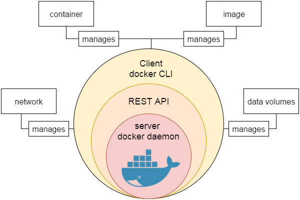
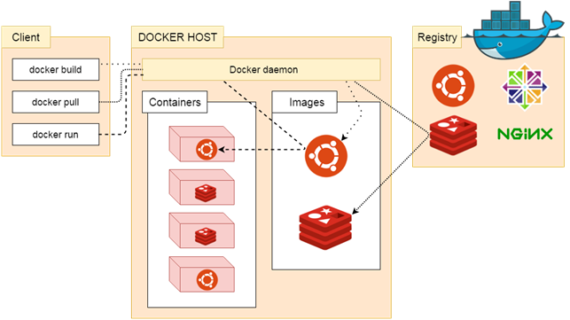

# Docker

## Docker 简介

>Docker 是一个开源的应用容器引擎，基于 Go 语言 并遵从 Apache2.0 协议开源。
>
>Docker 可以让开发者打包他们的应用以及依赖包到一个轻量级、可移植的容器中，然后发布到任何流行的 Linux 机器上，也可以实现虚拟化。
>
>容器是完全使用沙箱机制，相互之间不会有任何接口 (类似 iPhone 的 app)，更重要的是容器性能开销极低。

### Docker 的应用场景

- Web 应用的自动化打包和发布
- 自动化测试和持续集成、发布
- 在服务型环境中部署和调整数据库或其他的后台应用
- 从头编译或者扩展现有的 OpenShift 或 Cloud Foundry 平台来搭建自己的 PaaS (Platform-as-a-Service) 环境

### Docker 的优点

- 简化程序：Docker 让开发者可以打包他们的应用以及依赖包到一个可移植的容器中，然后发布到任何流行的 Linux 机器上，便可以实现虚拟化。Docker改变了虚拟化的方式，使开发者可以直接将自己的成果放入Docker中进行管理。方便快捷已经是 Docker的最大优势，过去需要用数天乃至数周的 任务，在Docker容器的处理下，只需要数秒就能完成。
- 避免选择恐惧症：如果你有选择恐惧症，还是资深患者。Docker 帮你打包你的纠结！比如 Docker 镜像；Docker 镜像中包含了运行环境和配置，所以 Docker 可以简化部署多种应用实例工作。比如 Web 应用、后台应用、数据库应用、大数据应用比如 Hadoop 集群、消息队列等等都可以打包成一个镜像部署。
- 节省开支：一方面，云计算时代到来，使开发者不必为了追求效果而配置高额的硬件，Docker 改变了高性能必然高价格的思维定势。Docker 与云的结合，让云空间得到更充分的利用。不仅解决了硬件管理的问题，也改变了虚拟化的方式。

### Docker 引擎

Docker 引擎是一个包含以下主要组件的客户端服务器应用程序。

- 一种服务器，它是一种称为守护进程并且长时间运行的程序。
- REST API用于指定程序可以用来与守护进程通信的接口，并指示它做什么。
- 一个有命令行界面 (CLI) 工具的客户端。

Docker 引擎组件的流程如下图所示：



------


## Docker  功能特点

### 轻松快捷的配置

这是Docker的一个主要功能，可帮助开发者轻松快速地配置系统。可以在更少的时间和精力的情况下部署代码。 由于Docker可以在各种各样的环境中使用，基础架构不再要求与应用程序的环境相关联。

### 提高工作效率

通过放宽技术配置和应用的快速部署。 毫无疑问，它节约了时间提高了生产率。 Docker不仅有助于在孤立环境中执行应用程序，而且还减少了资源。

### 应用隔离

Docker提供用于在隔离环境中运行应用程序的容器。 每个容器独立于另一个容器，并允许执行任何类型的应用程序。

### 云调度

它是Docker容器的集群和调度工具。 Swarm使用Docker API作为其前端，这有助于开发者使用各种工具来控制它。 它还可以将Docker主机集群控制为一个虚拟主机。 这是一个用于启用可插拔后端的自组织引擎组。

### 路由网

它将可用节点上已发布端口的传入请求路由到活动容器。 即使节点上没有任务正在运行，此功能也可以实现连接。

### 服务

服务是允许指定集群内的容器状态的任务列表。 每个任务表示一个应该运行的容器的一个实例，并且Swarm在节点之间调度它们。

### 安全管理

它允许将保密数据保存到云群 (swarm) 中，然后选择给予服务访问某些保密数据。它包括一些重要的命令给引擎，如保密数据检查，保密数据创建等。

------


## Docker 系统架构

> Docker 使用客户端-服务器 (C/S) 架构模式，使用远程 API 来管理和创建 Docker 容器。
>
> Docker 容器通过 Docker 镜像来创建。
>
> 容器与镜像的关系类似于面向对象编程中的对象与类。

**类比:**

| Docker | 面向对象 |
| :----- | :------- |
| 容器   | 对象     |
| 镜像   | 类       |

**架构图:**

**说明:**

| 标题            | 说明                                                         |
| :-------------- | :----------------------------------------------------------- |
| 镜像(Images)    | Docker 镜像是用于创建 Docker 容器的模板。                    |
| 容器(Container) | 容器是独立运行的一个或一组应用。                             |
| 客户端(Client)  | Docker 客户端通过命令行或者其他工具使用 [Docker API](https://docs.docker.com/reference/api/docker_remote_api)  与 Docker 的守护进程通信。 |
| 主机(Host)      | 一个物理或者虚拟的机器用于执行 Docker 守护进程和容器。       |
| 仓库(Registry)  | Docker 仓库用来保存镜像，可以理解为代码控制中的代码仓库。[Docker Hub](https://hub.docker.com) 提供了庞大的镜像集合供使用。 |
| Docker Machine  | Docker Machine是一个简化Docker安装的命令行工具，通过一个简单的命令行即可在相应的平台上安装Docker，比如VirtualBox、 Digital Ocean、Microsoft Azure。 |

------


## Docker 安装

> 可以在任何操作系统上安装 Docker，无论是 Mac，Windows，Linux 还是任何云服务器。Docker 引擎在 Linux 发行版上运行。 

### 前提条件

Docker 需要两个重要的安装要求：

- 它仅适用于 64 位 Linux 安装
- 它需要 Linux 内核版本 3.10 或更高版本。

要查看当前的内核版本，请打开终端并键入`uname -r`命令以查看内核版本：

```
GG42@ubuntu:/home/ubuntu# uname -r
4.15.0-91-generic
```

查看操作系统是32位还是64位：

```
GG42@ubuntu:/home/ubuntu# uname --m
x86_64
```

### 使用脚本安装 Docker

使用在线安装脚本

```
curl -sSL https://get.daocloud.io/docker | sh
```

执行后会自动下载并安装 Docker 及依赖包

```
GG42@UbuntuBase:~$ curl -sSL https://get.daocloud.io/docker | sh
# Executing docker install script, commit: 49ee7c1
+ sudo -E sh -c apt-get update -qq >/dev/null
+ sudo -E sh -c apt-get install -y -qq apt-transport-https ca-certificates curl software-properties-common >/dev/null
+ sudo -E sh -c curl -fsSL "https://download.docker.com/linux/ubuntu/gpg" | apt-key add -qq - >/dev/null
+ sudo -E sh -c echo "deb [arch=amd64] https://download.docker.com/linux/ubuntu xenial edge" > /etc/apt/sources.list.d/docker.list
+ [ ubuntu = debian ]
+ sudo -E sh -c apt-get update -qq >/dev/null
+ sudo -E sh -c apt-get install -y -qq --no-install-recommends docker-ce >/dev/null
+ sudo -E sh -c docker version
Client:
 Version:      17.10.0-ce
 API version:  1.33
 Go version:   go1.8.3
 Git commit:   f4ffd25
 Built:        Tue Oct 17 19:04:16 2017
 OS/Arch:      linux/amd64

Server:
 Version:      17.10.0-ce
 API version:  1.33 (minimum version 1.12)
 Go version:   go1.8.3
 Git commit:   f4ffd25
 Built:        Tue Oct 17 19:02:56 2017
 OS/Arch:      linux/amd64
 Experimental: false
If you would like to use Docker as a non-root user, you should now consider
adding your user to the "docker" group with something like:

  sudo usermod -aG docker GG42

Remember that you will have to log out and back in for this to take effect!

WARNING: Adding a user to the "docker" group will grant the ability to run
         containers which can be used to obtain root privileges on the
         docker host.
         Refer to https://docs.docker.com/engine/security/security/#docker-daemon-attack-surface
         for more information.
```

完成后有个提示

```
If you would like to use Docker as a non-root user, you should now consider
adding your user to the "docker" group with something like:

  sudo usermod -aG docker GG42

Remember that you will have to log out and back in for this to take effect!
```

当要以非 root 用户可以直接运行 docker 时，需要执行 `sudo usermod -aG docker 某个用户` 命令，然后重新登陆，否则会有如下报错

```
GG42@UbuntuBase:~$ docker run hello-world
docker: Got permission denied while trying to connect to the Docker daemon socket at unix:///var/run/docker.sock: Post http://%2Fvar%2Frun%2Fdocker.sock/v1.33/containers/create: dial unix /var/run/docker.sock: connect: permission denied.
See 'docker run --help'.
```

### 启动 Docker 后台服务

```
service docker start
```

### 查看 Docker 当前版本

```
GG42@UbuntuBase:~$ docker version
Client:
 Version:      17.10.0-ce
 API version:  1.33
 Go version:   go1.8.3
 Git commit:   f4ffd25
 Built:        Tue Oct 17 19:04:16 2017
 OS/Arch:      linux/amd64

Server:
 Version:      17.10.0-ce
 API version:  1.33 (minimum version 1.12)
 Go version:   go1.8.3
 Git commit:   f4ffd25
 Built:        Tue Oct 17 19:02:56 2017
 OS/Arch:      linux/amd64
 Experimental: false
```

### 配置加速器

由于网络原因，我们在 pull Image 的时候，从 `Docker Hub` 上下载会很慢... 所以，国内的 Docker 爱好者们就添加了一些国内的镜像 (mirror),方便大家使用。

修改配置文件

```
nano /lib/systemd/system/docker.service
```

添加 `--registry-mirror=https://jxus37ac.mirror.aliyuncs.com` 到 ExecStart：

保存配置：`systemctl daemon-reload`

重启服务：`service docker restart`

------

