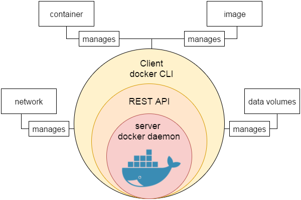
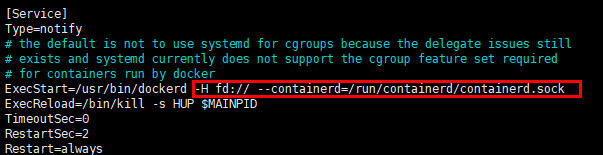
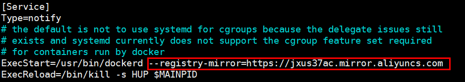

# Docker

## Docker 简介

>Docker 是一个开源的应用容器引擎，基于 Go 语言 并遵从 Apache2.0 协议开源。
>
>Docker 可以让开发者打包他们的应用以及依赖包到一个轻量级、可移植的容器中，然后发布到任何流行的 Linux 机器上，也可以实现虚拟化。
>
>容器是完全使用沙箱机制，相互之间不会有任何接口 (类似 iPhone 的 app)，更重要的是容器性能开销极低。

### Docker 的应用场景

- Web 应用的自动化打包和发布
- 自动化测试和持续集成、发布
- 在服务型环境中部署和调整数据库或其他的后台应用
- 从头编译或者扩展现有的 OpenShift 或 Cloud Foundry 平台来搭建自己的 PaaS (Platform-as-a-Service) 环境

### Docker 的优点

- 简化程序：Docker 让开发者可以打包他们的应用以及依赖包到一个可移植的容器中，然后发布到任何流行的 Linux 机器上，便可以实现虚拟化。Docker改变了虚拟化的方式，使开发者可以直接将自己的成果放入Docker中进行管理。方便快捷已经是 Docker的最大优势，过去需要用数天乃至数周的 任务，在Docker容器的处理下，只需要数秒就能完成。
- 避免选择恐惧症：如果你有选择恐惧症，还是资深患者。Docker 帮你打包你的纠结！比如 Docker 镜像；Docker 镜像中包含了运行环境和配置，所以 Docker 可以简化部署多种应用实例工作。比如 Web 应用、后台应用、数据库应用、大数据应用比如 Hadoop 集群、消息队列等等都可以打包成一个镜像部署。
- 节省开支：一方面，云计算时代到来，使开发者不必为了追求效果而配置高额的硬件，Docker 改变了高性能必然高价格的思维定势。Docker 与云的结合，让云空间得到更充分的利用。不仅解决了硬件管理的问题，也改变了虚拟化的方式。

### Docker 引擎

Docker 引擎是一个包含以下主要组件的客户端服务器应用程序。

- 一种服务器，它是一种称为守护进程并且长时间运行的程序。
- REST API用于指定程序可以用来与守护进程通信的接口，并指示它做什么。
- 一个有命令行界面 (CLI) 工具的客户端。

Docker 引擎组件的流程如下图所示：



------


## Docker  功能特点

### 轻松快捷的配置

这是Docker的一个主要功能，可帮助开发者轻松快速地配置系统。可以在更少的时间和精力的情况下部署代码。 由于Docker可以在各种各样的环境中使用，基础架构不再要求与应用程序的环境相关联。

### 提高工作效率

通过放宽技术配置和应用的快速部署。 毫无疑问，它节约了时间提高了生产率。 Docker不仅有助于在孤立环境中执行应用程序，而且还减少了资源。

### 应用隔离

Docker提供用于在隔离环境中运行应用程序的容器。 每个容器独立于另一个容器，并允许执行任何类型的应用程序。

### 云调度

它是Docker容器的集群和调度工具。 Swarm使用Docker API作为其前端，这有助于开发者使用各种工具来控制它。 它还可以将Docker主机集群控制为一个虚拟主机。 这是一个用于启用可插拔后端的自组织引擎组。

### 路由网

它将可用节点上已发布端口的传入请求路由到活动容器。 即使节点上没有任务正在运行，此功能也可以实现连接。

### 服务

服务是允许指定集群内的容器状态的任务列表。 每个任务表示一个应该运行的容器的一个实例，并且Swarm在节点之间调度它们。

### 安全管理

它允许将保密数据保存到云群 (swarm) 中，然后选择给予服务访问某些保密数据。它包括一些重要的命令给引擎，如保密数据检查，保密数据创建等。

------


## Docker 系统架构

> Docker 使用客户端-服务器 (C/S) 架构模式，使用远程 API 来管理和创建 Docker 容器。
>
> Docker 容器通过 Docker 镜像来创建。
>
> 容器与镜像的关系类似于面向对象编程中的对象与类。

**类比:**

| Docker | 面向对象 |
| :----- | :------- |
| 容器   | 对象     |
| 镜像   | 类       |

**架构图:**

**说明:**

| 标题            | 说明                                                         |
| :-------------- | :----------------------------------------------------------- |
| 镜像(Images)    | Docker 镜像是用于创建 Docker 容器的模板。                    |
| 容器(Container) | 容器是独立运行的一个或一组应用。                             |
| 客户端(Client)  | Docker 客户端通过命令行或者其他工具使用 [Docker API](https://docs.docker.com/reference/api/docker_remote_api)  与 Docker 的守护进程通信。 |
| 主机(Host)      | 一个物理或者虚拟的机器用于执行 Docker 守护进程和容器。       |
| 仓库(Registry)  | Docker 仓库用来保存镜像，可以理解为代码控制中的代码仓库。[Docker Hub](https://hub.docker.com) 提供了庞大的镜像集合供使用。 |
| Docker Machine  | Docker Machine是一个简化Docker安装的命令行工具，通过一个简单的命令行即可在相应的平台上安装Docker，比如VirtualBox、 Digital Ocean、Microsoft Azure。 |

------


## Docker 安装

> 可以在任何操作系统上安装 Docker，无论是 Mac，Windows，Linux 还是任何云服务器。Docker 引擎在 Linux 发行版上运行。 

### 前提条件

Docker 需要两个重要的安装要求：

- 它仅适用于 64 位 Linux 安装
- 它需要 Linux 内核版本 3.10 或更高版本。

要查看当前的内核版本，请打开终端并键入`uname -r`命令以查看内核版本：

```
GG42@ubuntu:/home/ubuntu# uname -r
4.15.0-91-generic
```

查看操作系统是32位还是64位：

```
GG42@ubuntu:/home/ubuntu# uname --m
x86_64
```

### 使用脚本安装 Docker

使用在线安装脚本

```
curl -sSL https://get.daocloud.io/docker | sh
```

执行后会自动下载并安装 Docker 及依赖包

```
GG42@Ubuntu:~$ curl -sSL https://get.daocloud.io/docker | sh
# Executing docker install script, commit: 49ee7c1
+ sudo -E sh -c apt-get update -qq >/dev/null
+ sudo -E sh -c apt-get install -y -qq apt-transport-https ca-certificates curl software-properties-common >/dev/null
+ sudo -E sh -c curl -fsSL "https://download.docker.com/linux/ubuntu/gpg" | apt-key add -qq - >/dev/null
+ sudo -E sh -c echo "deb [arch=amd64] https://download.docker.com/linux/ubuntu xenial edge" > /etc/apt/sources.list.d/docker.list
+ [ ubuntu = debian ]
+ sudo -E sh -c apt-get update -qq >/dev/null
+ sudo -E sh -c apt-get install -y -qq --no-install-recommends docker-ce >/dev/null
+ sudo -E sh -c docker version
Client:
 Version:      17.10.0-ce
 API version:  1.33
 Go version:   go1.8.3
 Git commit:   f4ffd25
 Built:        Tue Oct 17 19:04:16 2017
 OS/Arch:      linux/amd64

Server:
 Version:      17.10.0-ce
 API version:  1.33 (minimum version 1.12)
 Go version:   go1.8.3
 Git commit:   f4ffd25
 Built:        Tue Oct 17 19:02:56 2017
 OS/Arch:      linux/amd64
 Experimental: false
If you would like to use Docker as a non-root user, you should now consider
adding your user to the "docker" group with something like:

  sudo usermod -aG docker GG42

Remember that you will have to log out and back in for this to take effect!

WARNING: Adding a user to the "docker" group will grant the ability to run
         containers which can be used to obtain root privileges on the
         docker host.
         Refer to https://docs.docker.com/engine/security/security/#docker-daemon-attack-surface
         for more information.
```

完成后有个提示

```
If you would like to use Docker as a non-root user, you should now consider
adding your user to the "docker" group with something like:

  sudo usermod -aG docker GG42

Remember that you will have to log out and back in for this to take effect!
```

当要以非 root 用户可以直接运行 docker 时，需要执行 `sudo usermod -aG docker 某个用户` 命令，然后重新登陆，否则会有如下报错

```
GG42@Ubuntu:~$ docker run hello-world
docker: Got permission denied while trying to connect to the Docker daemon socket at unix:///var/run/docker.sock: Post http://%2Fvar%2Frun%2Fdocker.sock/v1.33/containers/create: dial unix /var/run/docker.sock: connect: permission denied.
See 'docker run --help'.
```

### 启动 Docker 后台服务

```
service docker start
```

### 查看 Docker 当前版本

```
GG42@Ubuntu:~$ docker version
Client:
 Version:      17.10.0-ce
 API version:  1.33
 Go version:   go1.8.3
 Git commit:   f4ffd25
 Built:        Tue Oct 17 19:04:16 2017
 OS/Arch:      linux/amd64

Server:
 Version:      17.10.0-ce
 API version:  1.33 (minimum version 1.12)
 Go version:   go1.8.3
 Git commit:   f4ffd25
 Built:        Tue Oct 17 19:02:56 2017
 OS/Arch:      linux/amd64
 Experimental: false
```

### 配置加速器

由于网络原因，在 pull Image 的时候，从 `Docker Hub` 上下载会很慢... 所以，国内的 Docker 爱好者们就添加了一些国内的镜像 (mirror),方便大家使用。

修改配置文件

```
nano /lib/systemd/system/docker.service
```

添加 `--registry-mirror=https://jxus37ac.mirror.aliyuncs.com` 到 ExecStart：



修改为:



保存配置：`systemctl daemon-reload`

重启服务：`service docker restart`

------


## Docker 基本使用

### Docker 应用程序

> Docker 允许在容器内运行应用程序，使用 docker run 命令来在容器内运行一个应用程序。

输出 Hello Docker:

```shell
GG42@Ubuntu:~$ docker run ubuntu:15.10 /bin/echo "Hello Docker"
Hello Docker
```

参数解释：

- docker：Docker 的二进制执行文件
- run：与前面的 docker 组合来运行一个容器
- ubuntu:15.10：指定要运行的镜像，Docker首先从本地主机上查找镜像是否存在，如果不存在，Docker 就会从镜像仓库 Docker Hub 下载公共镜像
- /bin/echo "Hello Docker"：在启动的容器里执行的命令

以上命令完整的意思可以解释为：Docker 以 ubuntu15.10 镜像创建一个新容器，然后在容器里执行 bin/echo "Hello Docker"，然后输出结果。


### 运行交互式的容器

通过 docker 的两个参数 `-i` `-t`，让 docker 运行的容器实现"对话"的能力

```
GG42@Ubuntu:~$ docker run -it ubuntu:15.10 /bin/bash
root@76ab065de67b:/#
```

参数解释：

- `-t`：在新容器内指定一个伪终端或终端
- `-i`：允许对容器内的标准输入进行交互
- `ubuntu:` ubuntu 镜像
- `:15.10:`ubuntu 版本号.
- `/bin/bash`：放在镜像名后的是命令，这里希望有个交互式 Shell，因此用的是 /bin/bash。

此时已进入一个 ubuntu15.10 系统的容器

尝试在容器中运行命令 cat /proc/version 和 ls 分别查看当前系统的版本信息和当前目录下的文件列表

```
root@76ab065de67b:/# cat /proc/version
Linux version 4.4.0-21-generic (buildd@lgw01-21) (gcc version 5.3.1 20160413 (Ubuntu 5.3.1-14ubuntu2) ) #37-Ubuntu SMP Mon Apr 18 18:33:37 UTC 2016
root@76ab065de67b:/# ls
bin  boot  dev  etc  home  lib  lib64  media  mnt  opt  proc  root  run  sbin  srv  sys  tmp  usr  var
```

退出容器：

- 运行 `exit`
- 使用 `CTRL + D`


### 以后台的方式运行容器

使用以下命令创建一个以进程方式运行的容器

```
root@ubuntu:~# docker run -d ubuntu:15.10 /bin/sh -c "while true; do echo hello docker; sleep 1; done"
2ab101b86f8c95daf431cfa8ac84a21adf8dc13c1a8127aa43f421942ff7a219
```

通过 docker 参数 `-d `，让 docker 以进程方式运行的容器

在输出中，没有看到"hello docker"，而是一串长字符

```
2ab101b86f8c95daf431cfa8ac84a21adf8dc13c1a8127aa43f421942ff7a219
```

这个长字符串叫做容器ID，对每个容器来说都是唯一的，可以通过容器ID来查看对应的容器发生了什么。

首先，需要确认容器有在运行，可以通过 `docker ps` 来查看

```
lusifer@UbuntuBase:~$ docker ps
root@ubuntu:~# docker ps
CONTAINER ID        IMAGE               COMMAND                  CREATED              STATUS              PORTS               NAMES
2ab101b86f8c        ubuntu:15.10        "/bin/sh -c 'while t…"   About a minute ago   Up About a minute                       tender_shannon
```

CONTAINER ID：容器ID

NAMES：自动分配的容器名称

在容器内使用 `docker logs` 或 `docker -f logs `命令，查看容器内的标准输出

```
root@ubuntu:~# docker logs -f 2ab101b86f8c
hello docker
hello docker
hello docker
hello docker
hello docker
hello docker
hello docker
hello docker
hello docker
hello docker
hello docker
hello docker
hello docker
hello docker
```

#### 与正在运行的容器交互

- **dokcer attach**

  ```shell
  docker attach 2ab101b86f8c
  ```

  **注意:**如果从这个容器退出，会导致容器的停止

- **docker exec**:

  ```shell
  docker exec -it <container> /bin/bash
  ```

  **注意:**如果从这个容器退出，不会导致容器的停止,更多的参数说明使用`docker exec --help`

例如:

```shell
root@ubuntu:~# docker exec -it 2ab101b86f8c /bin/bash
root@2ab101b86f8c:/# ll
total 72
drwxr-xr-x   1 root root 4096 Mar 23 13:48 ./
drwxr-xr-x   1 root root 4096 Mar 23 13:48 ../
-rwxr-xr-x   1 root root    0 Mar 23 13:48 .dockerenv*
drwxr-xr-x   2 root root 4096 Jul  6  2016 bin/
drwxr-xr-x   2 root root 4096 Oct 19  2015 boot/
drwxr-xr-x   5 root root  340 Mar 23 13:48 dev/
drwxr-xr-x   1 root root 4096 Mar 23 13:48 etc/
```


### 停止容器

命令:`docker stop <container>` 

```shell
root@ubuntu:~# docker stop 2ab101b86f8
2ab101b86f8

root@ubuntu:~# docker ps -a
CONTAINER ID        IMAGE               COMMAND             CREATED             STATUS              PORTS               NAMES
```

------


## Docker 容器管理

### Docker 客户端

docker客户端非常简单，可以直接输入`docker`命令来查看到Docker客户端的所有命令选项。

```shell
root@ubuntu:~# docker

Usage:	docker [OPTIONS] COMMAND

A self-sufficient runtime for containers

Options:
      --config string      Location of client config files (default "/root/.docker")
  -c, --context string     Name of the context to use to connect to the daemon (overrides DOCKER_HOST env
                           var and default context set with "docker context use")
  -D, --debug              Enable debug mode
  -H, --host list          Daemon socket(s) to connect to
  -l, --log-level string   Set the logging level ("debug"|"info"|"warn"|"error"|"fatal") (default "info")
      --tls                Use TLS; implied by --tlsverify
      --tlscacert string   Trust certs signed only by this CA (default "/root/.docker/ca.pem")
      --tlscert string     Path to TLS certificate file (default "/root/.docker/cert.pem")
      --tlskey string      Path to TLS key file (default "/root/.docker/key.pem")
      --tlsverify          Use TLS and verify the remote
  -v, --version            Print version information and quit

Management Commands:
  builder     Manage builds
  config      Manage Docker configs
  container   Manage containers
  context     Manage contexts
  engine      Manage the docker engine
  image       Manage images
  network     Manage networks
  node        Manage Swarm nodes
  plugin      Manage plugins
  secret      Manage Docker secrets
  service     Manage services
  stack       Manage Docker stacks
  swarm       Manage Swarm
  system      Manage Docker
  trust       Manage trust on Docker images
  volume      Manage volumes

Commands:
  attach      Attach local standard input, output, and error streams to a running container
  build       Build an image from a Dockerfile
  commit      Create a new image from a container's changes
  cp          Copy files/folders between a container and the local filesystem
  create      Create a new container
  diff        Inspect changes to files or directories on a container's filesystem
  events      Get real time events from the server
  exec        Run a command in a running container
  export      Export a container's filesystem as a tar archive
  history     Show the history of an image
  images      List images
  import      Import the contents from a tarball to create a filesystem image
  info        Display system-wide information
  inspect     Return low-level information on Docker objects
  kill        Kill one or more running containers
  load        Load an image from a tar archive or STDIN
  login       Log in to a Docker registry
  logout      Log out from a Docker registry
  logs        Fetch the logs of a container
  pause       Pause all processes within one or more containers
  port        List port mappings or a specific mapping for the container
  ps          List containers
  pull        Pull an image or a repository from a registry
  push        Push an image or a repository to a registry
  rename      Rename a container
  restart     Restart one or more containers
  rm          Remove one or more containers
  rmi         Remove one or more images
  run         Run a command in a new container
  save        Save one or more images to a tar archive (streamed to STDOUT by default)
  search      Search the Docker Hub for images
  start       Start one or more stopped containers
  stats       Display a live stream of container(s) resource usage statistics
  stop        Stop one or more running containers
  tag         Create a tag TARGET_IMAGE that refers to SOURCE_IMAGE
  top         Display the running processes of a container
  unpause     Unpause all processes within one or more containers
  update      Update configuration of one or more containers
  version     Show the Docker version information
  wait        Block until one or more containers stop, then print their exit codes

```

可以通过命令`docker command --help`更深入的了解指定的Docker命令使用方法。

例如要查看`docker stats`指令的具体使用方法：

``` shell
lusifer@UbuntuBase:~$ docker stats --help

Usage:    docker stats [OPTIONS] [CONTAINER...]

Display a live stream of container(s) resource usage statistics

Options:
  -a, --all             Show all containers (default shows just running)
      --format string   Pretty-print images using a Go template
      --help            Print usage
      --no-stream       Disable streaming stats and only pull the first result
      --no-trunc        Do not truncate output
```

### 运行 WEB 容器

使用docker构建一个web应用程序,将在docker容器中运行一个Python Flask应用来运行一个web应用。

```shell
root@ubuntu:~# docker run -d -P training/webapp python app.py
41fb6df8992ed8391045cbdc2b5d6b7deb7c45ca0d31f1afe62d4e13b094cc2e
```

参数说明：

- `-d`：让容器在后台运行
- `-P`：将容器内部使用的网络端口映射到使用的主机上
- `-p`:   绑定指定端口

```shell
docker run -d -p 3000:5000 training/webapp python app.py
26d4cf1edcdb7a25bc2d7bb54c01927c97934e25805dcd434a394064947cb2f1
```

**注意**:将宿主机的5000端口与容器中的5000端口进行映射.

### 查看 WEB 容器

使用 `docker ps` 来查看正在运行的容器

```shell
root@ubuntu:~# docker ps
CONTAINER ID        IMAGE               COMMAND             CREATED             STATUS              PORTS                    NAMES
628546ff23bd        training/webapp     "python app.py"     42 seconds ago      Up 41 seconds       0.0.0.0:3000->5000/tcp   vigorous_curran
```

这里多了端口信息:

```
PORTS
0.0.0.0:3000->5000/tcp
```

Docker 开放了 `3000` 端口（默认 Python Flask 端口）映射到主机端口 `32771` 上。

这时可以通过浏览器访问WEB应用


### 查看 WEB 应用日志

`docker logs <container>` 可以查看容器内部的标准输出：

```shell
root@ubuntu:~# docker logs -f vigorous_curran 
 * Running on http://0.0.0.0:5000/ (Press CTRL+C to quit)
192.168.52.1 - - [24/Mar/2020 14:18:42] "GET / HTTP/1.1" 200 -
192.168.52.1 - - [24/Mar/2020 14:18:43] "GET /favicon.ico HTTP/1.1" 404 -
```

参数说明：

- `-f`：让 dokcer logs 像使用 tail -f 一样来输出容器内部的标准输出

应用程序使用的是 5000 端口并且能够查看到应用程序的访问日志。

### 查看 WEB 应用容器的进程

使用 `docker top <container>` 来查看容器内部运行的进程:

```shell
root@ubuntu:~# docker top vigorous_curran 
UID                 PID                 PPID                C                   STIME               TTY                 TIME                CMD
root                3777                3745                0                   14:18               ?                   00:00:00            python app.py

```


### 检查 WEB 应用程序

使用 `docker inspect` 来查看Docker的底层信息。它会返回一个 JSON 文件记录着 Docker 容器的配置和状态信息：

```shell
root@ubuntu:~# docker inspect vigorous_curran 
[
    {
        "Id": "628546ff23bd660867c9d1753b90685bec3109a1bdbfbbf8c19d7397235d05c4",
        "Created": "2020-03-24T14:18:31.147728231Z",
        "Path": "python",
        "Args": [
            "app.py"
        ],
        "State": {
            "Status": "running",
            "Running": true,
            "Paused": false,
            "Restarting": false,
            "OOMKilled": false,
            "Dead": false,
            "Pid": 3777,
            "ExitCode": 0,
            "Error": "",
            "StartedAt": "2020-03-24T14:18:32.07062617Z",
            "FinishedAt": "0001-01-01T00:00:00Z"
        },
        "Image": "sha256:6fae60ef344644649a39240b94d73b8ba9c67f898ede85cf8e947a887b3e6557",
        "ResolvConfPath": "/var/lib/docker/containers/628546ff23bd660867c9d1753b90685bec3109a1bdbfbbf8c19d7397235d05c4/resolv.conf",
        "HostnamePath": "/var/lib/docker/containers/628546ff23bd660867c9d1753b90685bec3109a1bdbfbbf8c19d7397235d05c4/hostname",
        "HostsPath": "/var/lib/docker/containers/628546ff23bd660867c9d1753b90685bec3109a1bdbfbbf8c19d7397235d05c4/hosts",
        "LogPath": "/var/lib/docker/containers/628546ff23bd660867c9d1753b90685bec3109a1bdbfbbf8c19d7397235d05c4/628546ff23bd660867c9d1753b90685bec3109a1bdbfbbf8c19d7397235d05c4-json.log",
        "Name": "/vigorous_curran",
        "RestartCount": 0,
        "Driver": "overlay2",
        "Platform": "linux",
        "MountLabel": "",
        "ProcessLabel": "",
        "AppArmorProfile": "docker-default",
        "ExecIDs": null,
        "HostConfig": {
            "Binds": null,
            "ContainerIDFile": "",
            "LogConfig": {
                "Type": "json-file",
                "Config": {}
            },
            "NetworkMode": "default",
            "PortBindings": {
                "5000/tcp": [
                    {
                        "HostIp": "",
                        "HostPort": "3000"
                    }
                ]
            },
            "RestartPolicy": {
                "Name": "no",
                "MaximumRetryCount": 0
            },
            "AutoRemove": false,
            "VolumeDriver": "",
            "VolumesFrom": null,
            "CapAdd": null,
            "CapDrop": null,
            "Capabilities": null,
            "Dns": [],
            "DnsOptions": [],
            "DnsSearch": [],
            "ExtraHosts": null,
            "GroupAdd": null,
            "IpcMode": "private",
            "Cgroup": "",
            "Links": null,
            "OomScoreAdj": 0,
            "PidMode": "",
            "Privileged": false,
            "PublishAllPorts": false,
            "ReadonlyRootfs": false,
            "SecurityOpt": null,
            "UTSMode": "",
            "UsernsMode": "",
            "ShmSize": 67108864,
            "Runtime": "runc",
            "ConsoleSize": [
                0,
                0
            ],
            "Isolation": "",
            "CpuShares": 0,
            "Memory": 0,
            "NanoCpus": 0,
            "CgroupParent": "",
            "BlkioWeight": 0,
            "BlkioWeightDevice": [],
            "BlkioDeviceReadBps": null,
            "BlkioDeviceWriteBps": null,
            "BlkioDeviceReadIOps": null,
            "BlkioDeviceWriteIOps": null,
            "CpuPeriod": 0,
            "CpuQuota": 0,
            "CpuRealtimePeriod": 0,
            "CpuRealtimeRuntime": 0,
            "CpusetCpus": "",
            "CpusetMems": "",
            "Devices": [],
            "DeviceCgroupRules": null,
            "DeviceRequests": null,
            "KernelMemory": 0,
            "KernelMemoryTCP": 0,
            "MemoryReservation": 0,
            "MemorySwap": 0,
            "MemorySwappiness": null,
            "OomKillDisable": false,
            "PidsLimit": null,
            "Ulimits": null,
            "CpuCount": 0,
            "CpuPercent": 0,
            "IOMaximumIOps": 0,
            "IOMaximumBandwidth": 0,
            "MaskedPaths": [
                "/proc/asound",
                "/proc/acpi",
                "/proc/kcore",
                "/proc/keys",
                "/proc/latency_stats",
                "/proc/timer_list",
                "/proc/timer_stats",
                "/proc/sched_debug",
                "/proc/scsi",
                "/sys/firmware"
            ],
            "ReadonlyPaths": [
                "/proc/bus",
                "/proc/fs",
                "/proc/irq",
                "/proc/sys",
                "/proc/sysrq-trigger"
            ]
        },
        "GraphDriver": {
            "Data": {
                "LowerDir": "/var/lib/docker/overlay2/5c49d38485ec183a83f2460e7305f9f4733d3d81662290f3a6b9edc588baa263-init/diff:/var/lib/docker/overlay2/07985c1f99e72a68bcff5bf8e8c19a3a6955931e3012671472cc8674cedaff58/diff:/var/lib/docker/overlay2/f96f9d4652810fc7c45d6223814c2ef88079328e41574ba91c6f70ddb3476230/diff:/var/lib/docker/overlay2/b546fe44d7fbefb8ab177b37c86fd66ea5a7adcf98877d271cecda5888a60b20/diff:/var/lib/docker/overlay2/63e97139498840ac9f97ef783c7897fcf897d7198f64a5b11affacbc3f49841b/diff:/var/lib/docker/overlay2/6c36ced57d4d77f619e18d6aa3cb4838f827f3c5422c16322675ef6b9cafc807/diff:/var/lib/docker/overlay2/6b4f3ec23381191729f37947b656201b937aeb3eea4809b956d2e6791f819c3d/diff:/var/lib/docker/overlay2/793430711c24d301da3ed6cb1079784c1e7b2b2003877d26d939bf258892b6c2/diff:/var/lib/docker/overlay2/64b0315635440d239e0cc9e1e06c646b8716121dc591fe776c6954c1a3eee67c/diff:/var/lib/docker/overlay2/89f8f0d396a255345a40784dd49176a1c218ab0075ccdb999a180a3a4042be82/diff:/var/lib/docker/overlay2/9d9da79fa448fef849f52fdccce65337fbe6aca83253917233703158a4c458e0/diff:/var/lib/docker/overlay2/b015f51c8c85747a054fe832ca8b1008894792c563ecf889c62c9c1fdba78d66/diff:/var/lib/docker/overlay2/f7216a32f66b1d55e0bb62bdf79bfa72265bf236ea3f19633a33397613d09721/diff:/var/lib/docker/overlay2/6507a08dbe58aea3a9119014ca87b13ed1366ffe8160ba86d843bfa13d622f06/diff",
                "MergedDir": "/var/lib/docker/overlay2/5c49d38485ec183a83f2460e7305f9f4733d3d81662290f3a6b9edc588baa263/merged",
                "UpperDir": "/var/lib/docker/overlay2/5c49d38485ec183a83f2460e7305f9f4733d3d81662290f3a6b9edc588baa263/diff",
                "WorkDir": "/var/lib/docker/overlay2/5c49d38485ec183a83f2460e7305f9f4733d3d81662290f3a6b9edc588baa263/work"
            },
            "Name": "overlay2"
        },
        "Mounts": [],
        "Config": {
            "Hostname": "628546ff23bd",
            "Domainname": "",
            "User": "",
            "AttachStdin": false,
            "AttachStdout": false,
            "AttachStderr": false,
            "ExposedPorts": {
                "5000/tcp": {}
            },
            "Tty": false,
            "OpenStdin": false,
            "StdinOnce": false,
            "Env": [
                "PATH=/usr/local/sbin:/usr/local/bin:/usr/sbin:/usr/bin:/sbin:/bin"
            ],
            "Cmd": [
                "python",
                "app.py"
            ],
            "Image": "training/webapp",
            "Volumes": null,
            "WorkingDir": "/opt/webapp",
            "Entrypoint": null,
            "OnBuild": null,
            "Labels": {}
        },
        "NetworkSettings": {
            "Bridge": "",
            "SandboxID": "7e6f72193012698b9a224701cf4630910cd5077679ca8d87df024a23a8fa388b",
            "HairpinMode": false,
            "LinkLocalIPv6Address": "",
            "LinkLocalIPv6PrefixLen": 0,
            "Ports": {
                "5000/tcp": [
                    {
                        "HostIp": "0.0.0.0",
                        "HostPort": "3000"
                    }
                ]
            },
            "SandboxKey": "/var/run/docker/netns/7e6f72193012",
            "SecondaryIPAddresses": null,
            "SecondaryIPv6Addresses": null,
            "EndpointID": "4db3cae4cb035ab9ba49475d3107d60fb78b26559c6caec2949e3e8ace2f6691",
            "Gateway": "172.17.0.1",
            "GlobalIPv6Address": "",
            "GlobalIPv6PrefixLen": 0,
            "IPAddress": "172.17.0.2",
            "IPPrefixLen": 16,
            "IPv6Gateway": "",
            "MacAddress": "02:42:ac:11:00:02",
            "Networks": {
                "bridge": {
                    "IPAMConfig": null,
                    "Links": null,
                    "Aliases": null,
                    "NetworkID": "9832d7824b75753cab36e85ab70f9ea2bb8f31fde62a8d19e523c31070c8d5f7",
                    "EndpointID": "4db3cae4cb035ab9ba49475d3107d60fb78b26559c6caec2949e3e8ace2f6691",
                    "Gateway": "172.17.0.1",
                    "IPAddress": "172.17.0.2",
                    "IPPrefixLen": 16,
                    "IPv6Gateway": "",
                    "GlobalIPv6Address": "",
                    "GlobalIPv6PrefixLen": 0,
                    "MacAddress": "02:42:ac:11:00:02",
                    "DriverOpts": null
                }
            }
        }
    }
]
```


### 重启 WEB 应用容器

#### 停止WEB应用容器

```shell
docker stop  <container>
```

#### 已经停止的容器，使用命令 `docker start` 来启动

```shell
docker start <container>
```

#### 重启WEB应用容器

```shell
docker restart <container>
```

#### 查询全部容器

```shell
docker ps -a
```

#### 查询最后一次创建的容器

```shell
docker ps -l
```


### 移除 WEB 应用容器

使用 `docker rm <container 1> <container 2> ... <container N>` 命令来删除不需要的容器：

```
root@ubuntu:~# docker rm 628546ff23bd vigorous_curran 
628546ff23bd
vigorous_curran 
```

**注意：**删除容器时，容器必须是停止状态，否则会报错

------

